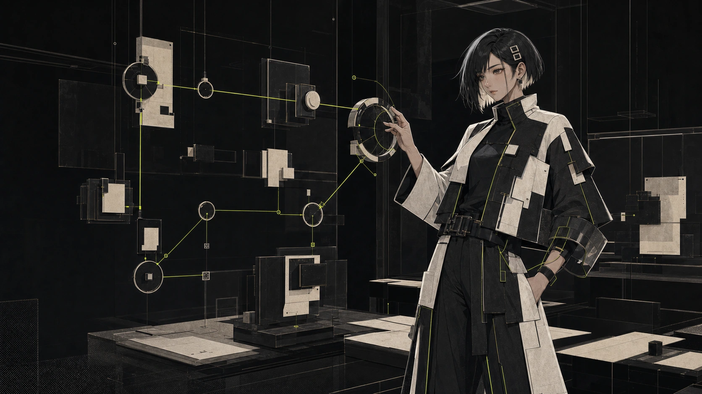
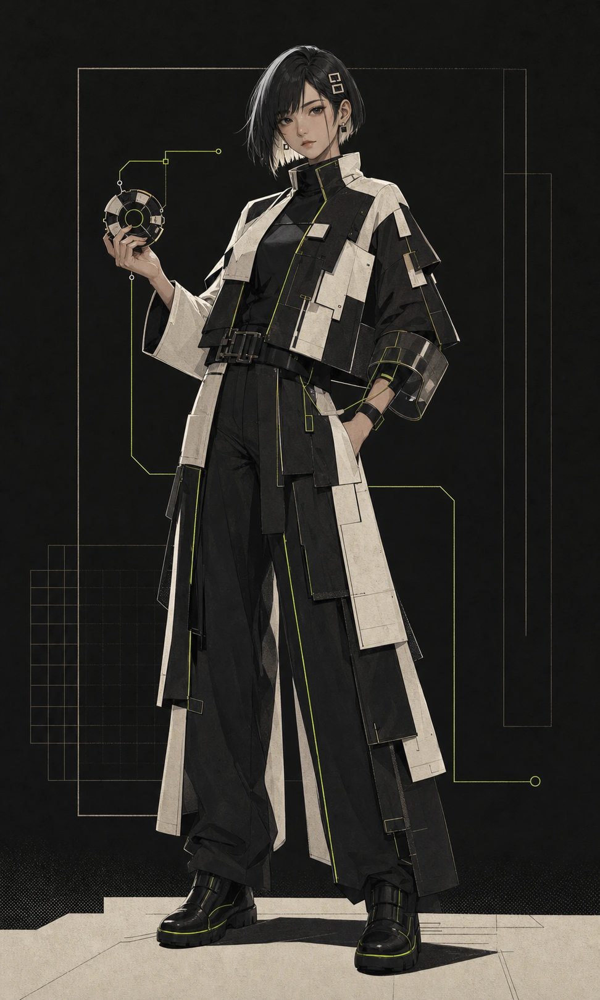

  

<h1 align="center">AponiaJS Visual Identity</h1>

  An experimental editorial system for visible, modular architecture.

This repository’s visual language presents AponiaJS as a framework whose
structure can be inspected rather than hidden. Monumental typography, strict
geometry, exposed connection paths, and cinematic architectural imagery turn
modules and runtime boundaries into an editorial world.

## Visual concept

**Experimental Editorial** defines the overall direction: large type behaves
like an image, artwork is given full-bleed space, and asymmetric compositions
create the pacing of a technical magazine. Interface decoration stays quiet so
each visual statement can stand on its own.

**Modular / Visible Architecture** defines the subject matter. Frames, towers,
transparent layers, routing lines, and separated planes make composition,
validation, and execution feel tangible. Connections should remain legible;
the system must never collapse into an anonymous futuristic texture.

The identity balances two modes:

- **Editorial restraint** — sharp edges, disciplined alignment, hairline
  divisions, sparse labels, and deliberate negative space.
- **Architectural atmosphere** — depth, translucent layers, suspended
  structures, visible paths, and a restrained sense of scale.

## Palette and material language

| Role | Value | Intent |
| --- | --- | --- |
| Near-black canvas | `#0b0c0a` | Primary field; deep enough to hold layered imagery without becoming pure black. |
| Dark surface | `#11120f` | Section and interface separation. |
| Raised surface | `#171813` | Subtle hierarchy without decorative elevation. |
| Editorial paper | `#e9eadf` | Warm, high-clarity type and line work. |
| Muted notation | `#9a9c90` | Captions, metadata, and secondary technical detail. |
| Signal accent | `#d7ff43` | A precise runtime or connection signal; use sparingly. |

The material system should feel like **ink, paper, smoked glass, and exposed
technical assemblies**:

- favor square crops, hard edges, and fine structural lines;
- use warm paper against near-black rather than sterile pure white;
- use translucent surfaces only when they reveal depth or hierarchy;
- keep grain subtle, like printed stock rather than a decorative noise effect;
- reserve the acid signal color for state, focus, or a visible route;
- avoid glossy card chrome, ornamental gradients, and arbitrary soft shapes.

## Original artwork archive

Every image embedded in this README is original AponiaJS project artwork. No
HoYoverse artwork is displayed here.

### Modular opening

  

The hero establishes the world at landscape scale: modular frames open toward
a visible route, with enough negative space to carry monumental editorial
type.

### System and architecture

| Runtime system | Architecture tower |
| --- | --- |
|  |  |
| Transparent layers expose the execution path instead of disguising it. | A portrait composition turns modular boundaries into a vertical editorial structure. |

### ApoliaJS-chan

  

The character anchor is the stable full-character reference for the mascot
identity. The landscape artwork at the top of this README connects the same
character to the modular runtime world.

## Mascot concept

**ApoliaJS-chan** is the original AponiaJS project mascot: an adult modular
framework architect. She represents composition, system boundaries,
orchestration, and architecture that remains understandable under pressure.
The character is an original design and does not use a third-party character
design.

Identity guidelines:

- always present ApoliaJS-chan as an adult technical architect;
- preserve her relationship to modular systems, visible routes, and deliberate
  structure;
- use calm authority and precise posture rather than exaggerated mascot
  comedy;
- keep the silhouette, costume language, and project-specific identity
  recognizable across crops;
- do not label or redesign her as Aponia or as a Honkai character;
- do not introduce third-party logos, costume elements, or character motifs;
- pair her with the established near-black, warm-paper, and signal-accent
  language.

The ApoliaJS-chan assets are retained as identity masters and are not yet wired
into the landing page.

## Asset usage

| Asset | Archive / master | Delivery format | Dimensions |
| --- | --- | --- | --- |
| Modular opening | — | `public/images/aponia-generated-hero.webp` | 1672 × 941 |
| Runtime system | — | `public/images/aponia-generated-system.webp` | 1448 × 1086 |
| Architecture tower | — | `public/images/aponia-generated-architecture.webp` | 957 × 1643 |
| ApoliaJS-chan character anchor | `public/images/apoliajs-chan-character-anchor.png` | `public/images/apoliajs-chan-character-anchor.webp` | 972 × 1619 |
| ApoliaJS-chan runtime editorial | `public/images/apoliajs-chan-runtime-editorial.png` | `public/images/apoliajs-chan-runtime-editorial.webp` | 1672 × 941 |

- Keep the PNG files as lossless ApoliaJS-chan masters.
- Use the optimized WebP files for websites, documentation, and previews.
- Preserve the original aspect ratio; crop with layout containers rather than
  destructively editing the source.
- Do not upscale assets beyond a size where their original resolution remains
  visually clean.
- Derivatives should preserve the core composition and must not imply a
  third-party collaboration or endorsement.

## Sources and attribution

The original generated illustrations and ApoliaJS-chan artwork do not require
an on-page credit. Their provenance, dimensions, usage status, and master-file
locations are recorded in
[ARTWORK_SOURCES.md](./ARTWORK_SOURCES.md).

That source record also documents separately credited third-party artwork used
on the website. Those images are intentionally excluded from this README and
must retain their specified source links and credits wherever they appear.

## Legal independence

**AponiaJS is an independent open-source project. It is not affiliated with,
endorsed by, or sponsored by HoYoverse.**

HoYoverse, Honkai Impact 3rd, Aponia, and all associated names, characters,
trademarks, and artwork remain the property of their respective rights
holders. References and credited artwork do not imply an official
relationship, partnership, or endorsement.
