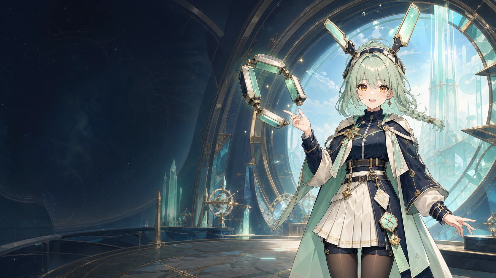
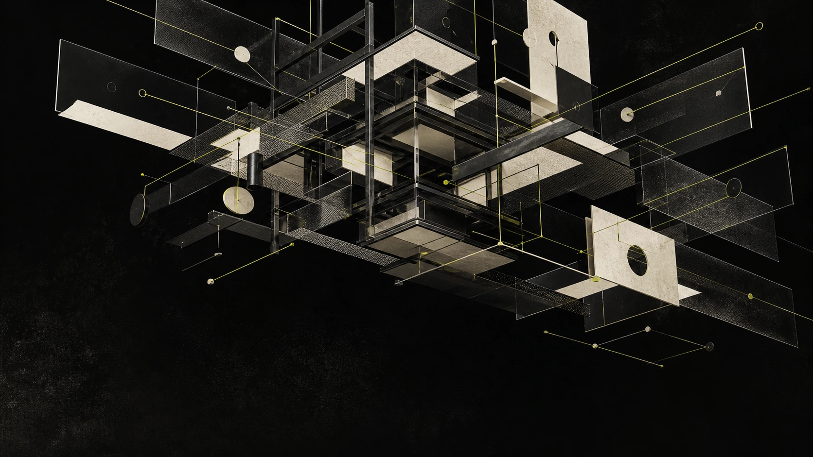
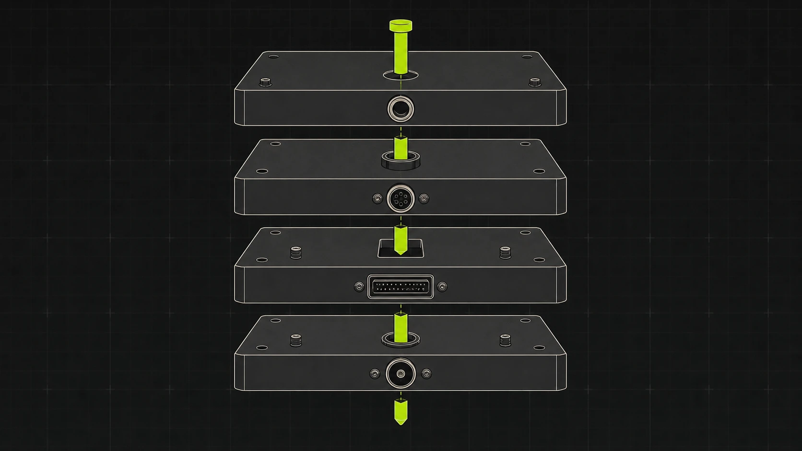
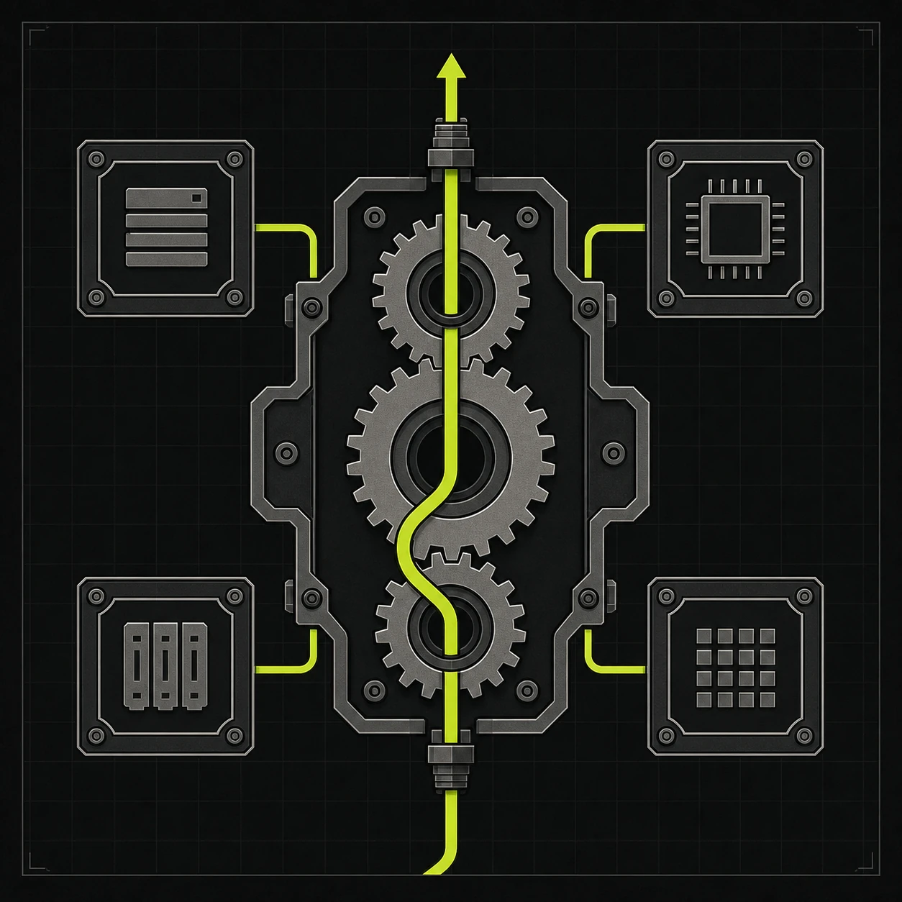
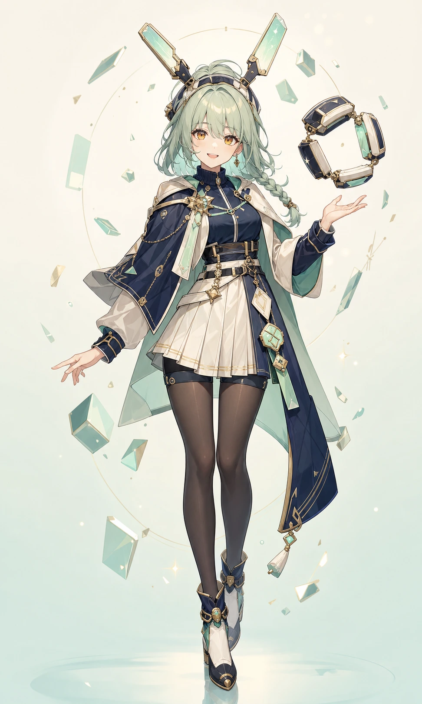

  

<h1 align="center">AponiaJS Docs & Artwork</h1>

  Documentation, visual identity, and original artwork archive for AponiaJS.

This repository houses the AponiaJS documentation website and its project-owned
visual assets. The identity combines experimental editorial composition with a
cute, original sci-fantasy RPG framework world: architecture stays modular,
routes remain visible, and the mascot makes the system feel approachable
without hiding its structure.

## Visual direction

The system is built around two complementary ideas:

- **Experimental Editorial** — monumental type, asymmetric pacing, sharp
  framing, generous negative space, and artwork treated as a primary
  storytelling surface.
- **Visible Architecture** — modules, dependency paths, runtime boundaries,
  and composition rings remain exposed instead of dissolving into generic
  futuristic scenery.

The imagery should feel designed rather than decorated. Technical structure is
part of the composition: panels separate responsibilities, lines show routes,
and rings establish boundaries or points of orchestration.

## Palette and materials

| Element | Direction |
| --- | --- |
| Navy | Primary structural field, clothing anchor, and technical depth. |
| Ivory | Editorial paper, readable contrast, and calm open space. |
| Mint | Framework signal, active route, and modular-system highlight. |
| Seafoam | AponiaJS-chan’s canonical hair color and a softer bridge between ivory and mint. |
| Amber | Eye color and a tightly controlled point of warmth. |

Materials combine matte editorial paper, deep painted panels, translucent
interfaces, fine technical lines, and restrained luminous signals. Prefer
crisp silhouettes and readable layers. Avoid unrelated logos, ornamental
effects that obscure the route system, or colors that compete with the
navy/ivory/mint foundation.

## Original artwork gallery

Every image embedded in this README is original AponiaJS project artwork
generated in-house with OpenAI image generation. No third-party character
artwork is displayed here.

### Framework environments

  

| Runtime system | Architecture tower |
| --- | --- |
|  |  |
| Transparent layers expose an execution path. | Modular boundaries become a vertical editorial structure. |

### AponiaJS-chan

| Canonical portrait | Framework cartographer hero |
| --- | --- |
|  |  |
| Full-character identity reference. | Landscape artwork connecting the mascot to the modular runtime world. |

## Mascot identity

**AponiaJS-chan** is the canonical original AponiaJS mascot: a cute sci-fantasy
RPG framework cartographer who maps modules, dependency routes, and runtime
boundaries.

Canonical traits:

- seafoam hair and amber eyes;
- mechanical Bun antenna panels;
- a navy, ivory, and mint palette;
- a modular ring representing composition and system boundaries;
- a cartographer role that turns framework structure into a readable world;
- an original silhouette and costume language with no third-party character
  design.

Keep AponiaJS-chan recognizable across crops and derivatives. Preserve the
seafoam/amber color anchors, mechanical antenna panels, modular ring, and
framework-cartographer role. Do not relabel her as a third-party character,
introduce third-party costume motifs, or imply an external collaboration.

The canonical name is **AponiaJS-chan**. The earlier “ApoliaJS-chan” spelling
and its corresponding assets are superseded and must not be used as the
current mascot identity.

## Asset usage

| Asset | PNG master | Optimized WebP | Dimensions |
| --- | --- | --- | --- |
| AponiaJS-chan portrait | `public/images/aponiajs-chan-portrait.png` | `public/images/aponiajs-chan-portrait.webp` | 972 × 1619 |
| AponiaJS-chan hero | `public/images/aponiajs-chan-hero.png` | `public/images/aponiajs-chan-hero.webp` | 1672 × 941 |
| Modular opening | — | `public/images/aponia-generated-hero.webp` | 1672 × 941 |
| Runtime system | — | `public/images/aponia-generated-system.webp` | 1448 × 1086 |
| Architecture tower | — | `public/images/aponia-generated-architecture.webp` | 957 × 1643 |

- Keep PNG files as lossless source masters.
- Use WebP files for websites, documentation, and repository previews.
- Preserve the original aspect ratio and crop non-destructively in layout.
- Do not overwrite a PNG master with an optimized derivative.
- Keep the mascot’s defining traits visible when creating a tight crop.
- Do not upscale an asset beyond a size where its source resolution remains
  visually clean.

## Sources and attribution

Project-owned generated artwork does not require an on-page third-party credit.
Its generation method, canonical status, dimensions, and file locations are
recorded in [ARTWORK_SOURCES.md](./ARTWORK_SOURCES.md).

That record also preserves the required provenance for historical third-party
artwork files that remain in the repository. Those works are intentionally not
embedded in this README and must keep their documented credits and source links
wherever they are used.

Documentation changes and artwork updates follow the repository policy in
[CONTRIBUTING.md](./CONTRIBUTING.md).

## Legal independence

**AponiaJS is an independent open-source project. It is not affiliated with,
endorsed by, or sponsored by HoYoverse or ElysiaJS.**

HoYoverse, Honkai Impact 3rd, Aponia, Elysia, ElysiaJS, and all associated
names, characters, trademarks, logos, and artwork remain the property of their
respective rights holders. References, compatibility, dependencies, or
credited historical artwork do not imply an official relationship,
partnership, sponsorship, or endorsement.
