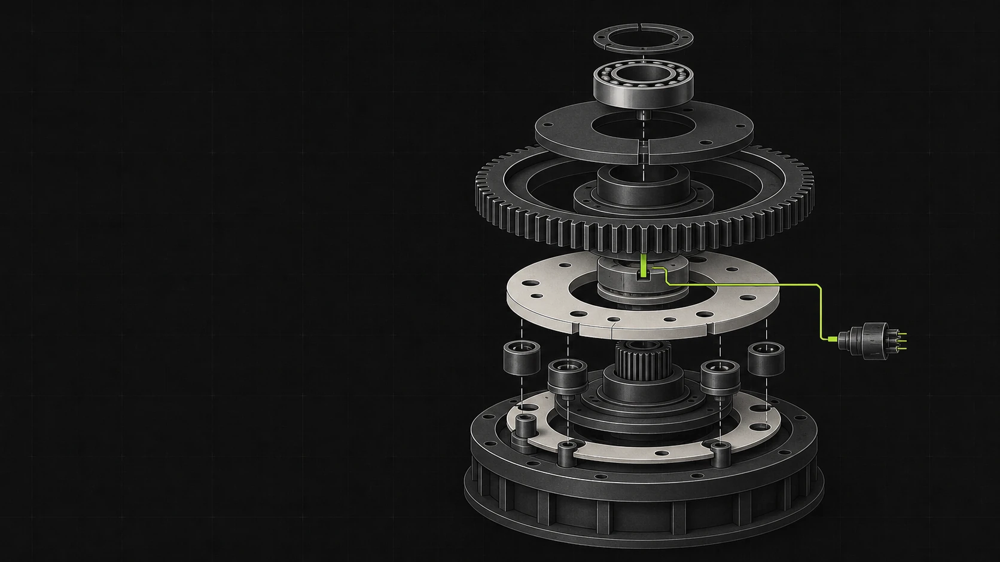

  

<h1 align="center">AponiaJS Docs & Artwork</h1>

  Documentation, visual identity, and original artwork archive for AponiaJS.

This repository houses the AponiaJS documentation website and its project-owned
visual assets. The website combines experimental editorial composition with
scroll-driven SVG paths and a written architecture note grounded in the
framework implementation. AponiaJS-chan remains a separate, original mascot
identity.

## Visual direction

The system is built around two complementary ideas:

- **Experimental Editorial** - monumental type, asymmetric pacing, sharp
  framing, generous negative space, and artwork treated as a primary
  storytelling surface.
- **Visible Architecture** - module compilation, graph validation, singleton
  resolution, plugin registration, and Elysia execution remain distinct.

The imagery should feel designed rather than decorated. Technical structure is
part of the composition: panels separate bootstrap phases, lines show only
verified relationships, and providers remain dependencies rather than request
pipeline stages.

## Palette and materials

| Element | Direction |
| --- | --- |
| Charcoal | Primary website field and technical-grid background. |
| Off-white | Mechanical outlines, typography, and readable contrast. |
| Lime | Active route and framework signal. |
| Graphite | Hairline rules, routing lines, and structural depth. |
| Seafoam and amber | Reserved for the AponiaJS-chan mascot identity. |

Website motion fields use matte black grids, off-white paths, and restrained
lime routing accents. The architecture note uses hairline rules, numbered
sections, and tabular figures. Mascot artwork keeps its separate navy, ivory, seafoam, mint, and
amber palette. Avoid motion that does not communicate execution or composition.

## Original artwork gallery

Every image embedded in this README is original AponiaJS project artwork
generated in-house with OpenAI image generation. No third-party character
artwork is displayed here.

### Superseded framework image studies

These generated studies remain in the artwork archive but are no longer used
by the landing page. The live interface now uses a scroll-driven SVG hero and
an implementation-grounded architecture note.

  

| Module layers | Runtime routing |
| --- | --- |
|  |  |
| Separate plates make module boundaries explicit. | A visible route passes directly through the runtime. |

### AponiaJS-chan

| Canonical portrait | Framework cartographer hero |
| --- | --- |
|  |  |
| Full-character identity reference. | Landscape artwork connecting the mascot to the modular runtime world. |

## Mascot identity

**AponiaJS-chan** is the canonical original AponiaJS mascot: a cute sci-fantasy
RPG framework cartographer who maps modules, dependency routes, and runtime
boundaries.

Canonical traits:

- seafoam hair and amber eyes;
- mechanical Bun antenna panels;
- a navy, ivory, and mint palette;
- a modular ring representing composition and system boundaries;
- a cartographer role that turns framework structure into a readable world;
- an original silhouette and costume language with no third-party character
  design.

Keep AponiaJS-chan recognizable across crops and derivatives. Preserve the
seafoam/amber color anchors, mechanical antenna panels, modular ring, and
framework-cartographer role. Do not relabel her as a third-party character,
introduce third-party costume motifs, or imply an external collaboration.

The canonical name is **AponiaJS-chan**. The earlier “ApoliaJS-chan” spelling
and its corresponding assets are superseded and must not be used as the
current mascot identity.

## Asset usage

| Asset | PNG master | Optimized WebP | Dimensions |
| --- | --- | --- | --- |
| AponiaJS-chan portrait | `public/images/aponiajs-chan-portrait.png` | `public/images/aponiajs-chan-portrait.webp` | 972 × 1619 |
| AponiaJS-chan hero | `public/images/aponiajs-chan-hero.png` | `public/images/aponiajs-chan-hero.webp` | 1672 × 941 |
| Technical assembly | Not applicable | `public/images/aponia-technical-landscape.webp` | 1672 × 941 |
| Runtime system | Not applicable | `public/images/aponia-generated-system.webp` | 1672 × 941 |
| Runtime routing | Not applicable | `public/images/aponia-generated-architecture.webp` | 1254 × 1254 |

- Keep PNG files as lossless source masters.
- Use WebP files for websites, documentation, and repository previews.
- Preserve the original aspect ratio and crop non-destructively in layout.
- Do not overwrite a PNG master with an optimized derivative.
- Keep the mascot’s defining traits visible when creating a tight crop.
- Do not upscale an asset beyond a size where its source resolution remains
  visually clean.

## Sources and attribution

Project-owned generated artwork does not require an on-page third-party credit.
Its generation method, canonical status, dimensions, and file locations are
recorded in [ARTWORK_SOURCES.md](./ARTWORK_SOURCES.md).

That record also preserves the required provenance for historical third-party
artwork files that remain in the repository. Those works are intentionally not
embedded in this README and must keep their documented credits and source links
wherever they are used.

Documentation changes and artwork updates follow the repository policy in
[CONTRIBUTING.md](./CONTRIBUTING.md).

## Legal independence

**AponiaJS is an independent open-source project. It is not affiliated with,
endorsed by, or sponsored by HoYoverse or ElysiaJS.**

HoYoverse, Honkai Impact 3rd, Aponia, Elysia, ElysiaJS, and all associated
names, characters, trademarks, logos, and artwork remain the property of their
respective rights holders. References, compatibility, dependencies, or
credited historical artwork do not imply an official relationship,
partnership, sponsorship, or endorsement.
