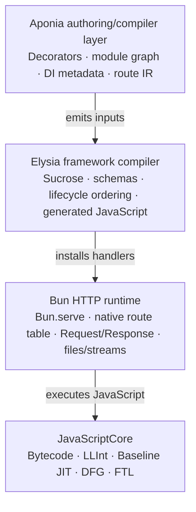
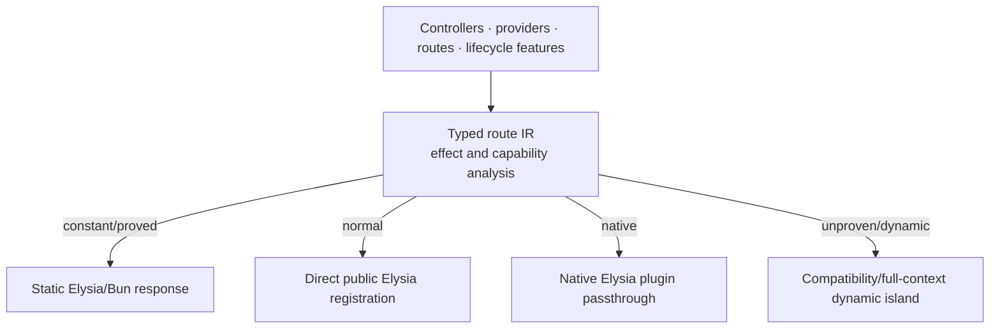
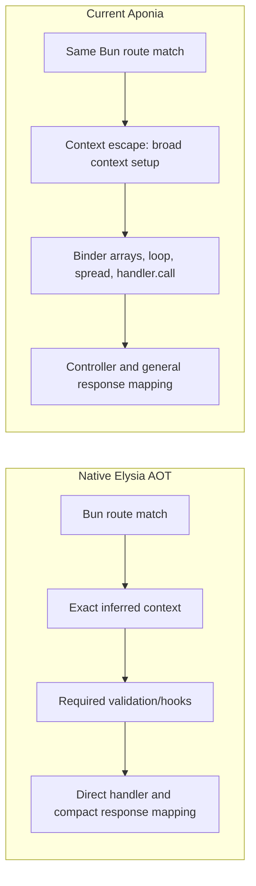

# AponiaJS versus Native Elysia on Bun

## Exhaustive Source-, Compiler-, Runtime-, and Benchmark-Level Performance Investigation

*Technical research report for `aponiajs/aponiajs`*  
*28 July 2026*

## Abstract

This paper investigates the highest theoretically and practically achievable performance of AponiaJS while preserving NestJS-like modules, controllers, decorators, dependency injection, lifecycle features, Elysia compatibility, Bun-native execution, debugging, and maintainability.  The primary comparison is AponiaJS 0.6.0-alpha.14 (tag `v0.6.0-alpha.14`, release commit `0df119d`), Elysia 1.4.29 (tag `1.4.29`, release commit `8358ff9`), and Bun 1.3.14 (tag `bun-v1.3.14`).  The supplied four-workload artifact is retained as measured evidence, but its missing hardware, concurrency, latency, allocation, and variance metadata sharply limits inference.

**Measured result.** Execution state is unreported in the artifact.  Within that artifact, AponiaJS/Elysia-AOT throughput ratios are 41.16% for Ping, 69.66% for Query, 61.50% for Body, and 94.74% for Video.  The artifact's raw average ratio is 55.00%; the equal-workload geometric mean is 63.93%.  These figures apply only to those four unnamed harness routes and cannot establish the performance of lazy versus precompiled Elysia, validation modes, or future Aponia architectures.

**Derived fact.** The dominant current fast-route loss is the decorated-controller adapter
`handler.call(instance, ...bindParameters(parameters, context))`.  It allocates arrays and traverses descriptors on every request.  More importantly, passing the whole context into a helper triggers Elysia Sucrose's conservative context-escape rule, making every context facility appear live.  Elysia then generates query, header, cookie, response-state, URL/path/route/server, and async-capable code that a direct route can omit.  Singleton DI and module-graph work are startup costs, not current per-request costs.

**Source fact.** Elysia's “JIT compiler” is not a machine-code JIT.  Elysia stringifies handlers, runs Sucrose, emits JavaScript source, and constructs functions with `Function(...)`.  JavaScriptCore (JSC), embedded by Bun, parses that JavaScript into bytecode and later performs true machine-code tiering through LLInt, Baseline JIT, DFG, and FTL.  Bun supplies the HTTP server, native route table, request objects, static-response dispatch, and file/stream fast paths.

**Hypothesis requiring benchmark validation.** For Bun 1.3.14, Elysia 1.4.29 AOT, a warmed synchronous no-validation dynamic route, logging disabled, and byte-identical output, route-specific runtime generation should make 90--95% of hand-written Elysia realistic; a hybrid build-time descriptor plus public Elysia-composition design makes 95--98.5% plausible; consistent 99% on a trivial route requires near code-shape identity and remains unproven.  Static-response or native-plugin semantic islands can reach operational equivalence.  The recommended architecture is a typed route intermediate representation with per-route lowering to direct Elysia, native static response, native plugin, or compatibility fallback.

## Contents

- [Executive summary](#executive-summary)
  - [Pinned scope and headline answers](#pinned-scope-and-headline-answers)
  - [Concise recommendation](#concise-recommendation)
- [Terminology and responsibility boundaries](#terminology-and-responsibility-boundaries)
- [Sources, versions, and evidence limitations](#sources-versions-and-evidence-limitations)
  - [Pinned implementations](#pinned-implementations)
  - [Supplied benchmark artifact](#supplied-benchmark-artifact)
  - [Evidence labels](#evidence-labels)
- [Who performs which compilation?](#who-performs-which-compilation)
  - [Elysia's pseudo-JIT](#elysias-pseudo-jit)
  - [JavaScriptCore's true JIT](#javascriptcores-true-jit)
- [Complete execution-pipeline reconstruction](#complete-execution-pipeline-reconstruction)
  - [Pipeline overview](#pipeline-overview)
  - [All-architecture runtime and resource analysis](#all-architecture-runtime-and-resource-analysis)
  - [1. Native Elysia AOT with lazy first-request composition](#1-native-elysia-aot-with-lazy-first-request-composition)
  - [2. Native Elysia AOT with `precompile:true`](#2-native-elysia-aot-with-precompiletrue)
  - [3. Elysia dynamic mode](#3-elysia-dynamic-mode)
  - [4. Elysia runtime-generated-function design](#4-elysia-runtime-generated-function-design)
  - [5. Current AponiaJS runtime-decorator architecture](#5-current-aponiajs-runtime-decorator-architecture)
  - [6. Runtime route-specific generated handlers](#6-runtime-route-specific-generated-handlers)
  - [7. Lazy first-request Aponia specialization](#7-lazy-first-request-aponia-specialization)
  - [8. Startup-time Aponia precompilation](#8-startup-time-aponia-precompilation)
  - [9. Build-time Aponia AOT](#9-build-time-aponia-aot)
  - [10. Hybrid build-time descriptor plus runtime Elysia composition](#10-hybrid-build-time-descriptor-plus-runtime-elysia-composition)
  - [11. Near-zero-runtime generated Elysia output](#11-near-zero-runtime-generated-elysia-output)
  - [12. Standalone `Bun.serve({routes})` output](#12-standalone-bunserveroutes-output)
  - [13. Superior architecture: typed route IR with semantic islands](#13-superior-architecture-typed-route-ir-with-semantic-islands)
- [Current AponiaJS source audit](#current-aponiajs-source-audit)
  - [Startup pipeline](#startup-pipeline)
  - [Native versus current request path](#native-versus-current-request-path)
  - [The generic wrapper and binder](#the-generic-wrapper-and-binder)
  - [Exact Sucrose failure chain](#exact-sucrose-failure-chain)
  - [Can JavaScriptCore optimize the current overhead away?](#can-javascriptcore-optimize-the-current-overhead-away)
  - [Exhaustive hot-path inventory](#exhaustive-hot-path-inventory)
- [Lifecycle features and specialization limits](#lifecycle-features-and-specialization-limits)
  - [Preserving NestJS-like semantics](#preserving-nestjs-like-semantics)
  - [Request-scoped DI](#request-scoped-di)
  - [Whole-context injection](#whole-context-injection)
  - [Undecorated methods, controllers, and provider captures](#undecorated-methods-controllers-and-provider-captures)
- [Compiler and architecture design-space exploration](#compiler-and-architecture-design-space-exploration)
  - [Search saturation](#search-saturation)
  - [Additional strategies discovered](#additional-strategies-discovered)
  - [Primary-source architecture analogies](#primary-source-architecture-analogies)
  - [Rejected approaches](#rejected-approaches)
- [Quantitative model](#quantitative-model)
  - [Service-time decomposition](#service-time-decomposition)
  - [Maximum allowable overhead](#maximum-allowable-overhead)
  - [Measured artifact baseline](#measured-artifact-baseline)
  - [Reciprocal-throughput proxy](#reciprocal-throughput-proxy)
  - [Architecture performance hypotheses](#architecture-performance-hypotheses)
- [Scaling analysis](#scaling-analysis)
  - [Asymptotic model](#asymptotic-model)
  - [Required route-count sweep](#required-route-count-sweep)
- [Weighted decision matrix](#weighted-decision-matrix)
- [Recommended production architecture](#recommended-production-architecture)
  - [Four explicit modes](#four-explicit-modes)
  - [Compiler phases](#compiler-phases)
  - [Representative generated output](#representative-generated-output)
  - [Why delegate final composition to Elysia](#why-delegate-final-composition-to-elysia)
  - [Deployment policy](#deployment-policy)
- [Reproducible benchmark specification](#reproducible-benchmark-specification)
  - [Pinned variants](#pinned-variants)
  - [Semantic route matrix](#semantic-route-matrix)
  - [Cold, first-hit, and warmed phases](#cold-first-hit-and-warmed-phases)
  - [Load and statistics](#load-and-statistics)
  - [CPU, allocation, GC, and code metrics](#cpu-allocation-gc-and-code-metrics)
  - [Generated-source regression tests](#generated-source-regression-tests)
  - [Falsifiable performance gates](#falsifiable-performance-gates)
- [P0--P3 implementation roadmap](#p0--p3-implementation-roadmap)
- [Risks, limitations, and falsifiers](#risks-limitations-and-falsifiers)
- [Explicit answers to the research questions](#explicit-answers-to-the-research-questions)
- [Final recommendation to AponiaJS maintainers](#final-recommendation-to-aponiajs-maintainers)

## Executive summary

### Pinned scope and headline answers

| Question | Answer | Scope and evidence |
| --- | --- | --- |
| What is current Aponia performance? | 41.16% Ping; 69.66% Query; 61.50% Body; 94.74% Video. | **Measured result.** Supplied artifact only; Bun-labelled rows; Aponia 0.6.0-alpha.14/Elysia 1.4.29/Bun 1.3.14 are the repository-declared versions, but route definitions and warm-state controls are absent. |
| Is Elysia's compiler a true JIT? | No. It is runtime JavaScript generation; JSC is the true machine-code JIT. | **Source fact.** Elysia `compose.ts` and Bun adapter call `Function`; WebKit documents LLInt, Baseline, DFG, and FTL. |
| What is the principal current hot-path cost? | Context escape plus generic argument binding. | **Derived fact.** Aponia lines 178--221 combined with Sucrose lines 516--719 and Elysia composition lines 557--744. |
| Does current DI run per request? | No. | **Source fact.** Singleton providers/controllers are resolved and cached during bootstrap; the route closure captures the controller instance. |
| Should Aponia copy Elysia's composer? | No, except for experiments. | Public Elysia composition preserves validators, plugins, lifecycle ordering, response mapping, and version resilience. Aponia should specialize its adapter and registration inputs. |
| Best general architecture? | Typed route IR with semantic islands. | **Hypothesis requiring benchmark validation.** Build-time graph/metadata lowering; direct Elysia output by default; static/native output only where semantics prove equivalence; compatibility fallback otherwise. |
| Highest defensible public claim now? | Publish measured per-route ratios only; set 95% as an engineering target, not a current claim. | For a future claim: Bun 1.3.14, Elysia 1.4.29 AOT precompiled, warmed sync Ping/path/query/JSON route matrix, identical validation and output, lower 95% confidence bound. |

### Concise recommendation

Aponia should remain an *authoring and application compiler* above Elysia, not become a second HTTP framework.  Its production compiler should:

1. lower decorators, modules, providers, routes, lifecycle metadata, and effects into a typed route IR;
1. generate direct, fixed-arity, Sucrose-visible controller adapters with no request-time metadata, arrays, spreads, `call`, or token lookup;
1. emit direct root Elysia registrations and delegate final parsing, validation, hook composition, errors, response mapping, and Bun installation to Elysia;
1. lower literal/static routes to Elysia/Bun static responses and pass native Elysia plugins through unchanged;
1. keep explicit compatibility and full-context modes for code that cannot be proven static;
1. validate generated code shape and semantic equivalence in CI.

This route-by-route design is superior to choosing one global “runtime” or “AOT” mode because the application can preserve dynamic Nest-like behavior where required without imposing that cost on routes that are statically knowable.

## Terminology and responsibility boundaries

| Term | Precise meaning in this paper | What it is not |
| --- | --- | --- |
| Build-time AOT | Aponia analyzes source/decorators before deployment and emits TypeScript/JavaScript, descriptors, factories, or registrations. | It is not native machine code; JSC still parses and tiers emitted JavaScript at runtime. |
| Startup precompilation | Runtime Aponia/Elysia generates all route functions after process start and before listening or readiness. | It is not build-time work and does not eliminate JSC warmup. |
| Lazy compilation | A route's specialized JavaScript is generated on its first request and cached. | It is not JSC tier-up, although both can occur during early requests. |
| Runtime code generation | Constructing JavaScript source and calling `Function` or equivalent while the process runs. | It is not inherently optimized machine code. |
| Elysia pseudo-JIT | Sucrose analysis plus route-specific JavaScript source emission and `Function` construction. | It is not WebKit's Baseline/DFG/FTL JIT. |
| True machine-code JIT | JSC converts bytecode/IR into native machine code, profiles types, inlines, speculates, deoptimizes, and recompiles. | Aponia and Elysia do not implement these tiers. |
| LLInt | JSC's low-level bytecode interpreter optimized for startup. | Not a compiler tier. |
| Baseline JIT | JSC's low-latency bytecode-template machine-code compiler with inline caches. | Not the highest optimizing tier. |
| DFG / FTL | JSC's optimizing machine-code tiers; DFG uses profile-guided speculation, FTL performs higher-throughput optimization. | Their activation is heuristic and not guaranteed for every route function. |
| Bun native routing | `Bun.serve({routes})` method/path matching and associated native server paths. | It does not perform Elysia validation or Aponia DI. |
| Sucrose inference | Elysia's function-source analysis that identifies context fields used by handlers and hooks. | It is not TypeScript type analysis and does not inspect a hidden controller method through an opaque helper. |
| Elysia route composition | Elysia emits a route-specific JavaScript function containing only inferred parsing, validation, hooks, and response logic. | It is distinct from Bun routing and JSC machine-code compilation. |
| Dynamic mode | Elysia `aot:false`: generic async dispatch through a dynamic router and broad runtime loops. | It is not “more JIT” than AOT; JSC JITs both modes. |
| First-request compilation | Elysia/Aponia route generation performed at first match, plus cold JSC execution of newly generated code. | It must be measured separately from warmed throughput. |
| Semantic island | A route lowered independently to direct Elysia, static response, standalone Bun, native plugin, or compatibility fallback according to proven requirements. | It is not an all-or-nothing application mode. |

## Sources, versions, and evidence limitations

### Pinned implementations

- **AponiaJS:** `v0.6.0-alpha.14`, release commit `0df119d`, published 28 July 2026.  The workspace declares Elysia `^1.4.29`, Bun 1.3.14, and TypeScript 7.0.2.[2](#ref-aponia-release), [3](#ref-aponia-package)
- **Elysia:** tag `1.4.29`, release commit `8358ff9`, published 16 June 2026.[10](#ref-elysia-release), [11](#ref-elysia-package)
- **Bun:** tag `bun-v1.3.14`, released 13 May 2026.  Bun's routing documentation is used for the static-response and route-table contract.[21](#ref-bun-release), [22](#ref-bun-routing)
- **JavaScriptCore:** the JSC architecture is documented from WebKit primary documentation.  The exact WebKit vendor revision embedded in the artifact's Bun binary was not supplied and could not be recovered from `results.md`; the reproducible benchmark must record the Bun binary commit and vendor revision.[23](#ref-jsc-overview), [24](#ref-jsc-speculation)

All repository citations in the bibliography identify tag, file, line range, and access date.  Branch URLs are avoided for claims that depend on source shape.

### Supplied benchmark artifact

The local file `prism-uploads/results.md` contains one table.  It does not contain route source, harness commit, Bun commit, operating system, CPU, firmware, power governor, core affinity, client, concurrency, duration, warm-up, keep-alive settings, payload bytes, validation schemas, trial count, variance, latency percentiles, allocations, GC, or profiles.[1](#ref-benchmark-artifact)

**Measured result.** The only safe numerical facts are table values and arithmetic derived directly from them.  The row named `elysia` must not be assumed to be Elysia dynamic mode; the artifact provides no configuration source.  Likewise, “AOT” does not reveal whether `precompile:true` was used.

### Evidence labels

- **Measured result.**: copied or arithmetically derived from the supplied artifact.
- **Source fact.**: directly visible in pinned primary source.
- **Derived fact.**: necessary consequence of cited source facts.
- **Modeled estimate.**: mathematical estimate with stated assumptions.
- **Hypothesis requiring benchmark validation.**: implementation prediction that requires the benchmark plan.
- **External architecture analogy.**: pattern borrowed from another system; not evidence of Aponia performance.
- **Rejected hypothesis.**: explored idea whose trade-offs are inferior for the stated constraints.

## Who performs which compilation?

<a id="fig-responsibilities"></a>


*Figure: Responsibility boundary.  Only JavaScriptCore performs true machine-code JIT compilation.*

### Elysia's pseudo-JIT

**Source fact.** Elysia's own documentation calls the mechanism a JIT “compiler” in quotation marks: it stringifies functions, performs custom static analysis, emits tailored JavaScript, and uses `new Function`/`Function` at runtime.[19](#ref-elysia-jit-doc)  In Elysia 1.4.29, the Bun route composer builds a source string and calls `Function('data', fnLiteral)`; the route composer similarly returns generated functions.[16](#ref-elysia-bun-compose), [14](#ref-elysia-compose)

The steps are:

1. collect route handler, validators, and lifecycle hooks;
1. call `Function.prototype.toString()` on relevant functions;
1. run Sucrose to infer context usage, caching inference by checksum;
1. select parsing, validation, hook, error, and response fragments;
1. concatenate JavaScript source;
1. construct a function with trusted framework data;
1. cache the composed route;
1. hand the function to Bun or invoke it from Elysia's general handler.

### JavaScriptCore's true JIT

**Source fact.** WebKit documents JSC as an optimizing VM with a parser, LLInt interpreter, Baseline JIT, DFG, and FTL.[23](#ref-jsc-overview)  Newly generated Elysia functions must first be parsed and converted to bytecode.  Early calls execute in LLInt; hot functions may tier to Baseline, then DFG, then FTL.  DFG/FTL use profiling and inline caches to speculate on types, structures, and known function values; failed speculation deoptimizes through on-stack replacement.[23](#ref-jsc-overview), [24](#ref-jsc-speculation)

**Derived fact.** “Elysia first-request compile time” and “JSC warmup time” are different:

- Elysia compilation ends when the generated JavaScript function exists.
- JSC parsing/bytecode generation occurs during function construction.
- JSC machine-code optimization occurs only after execution counters and profiles justify it.
- A precompiled Elysia route can still have cold JSC inline caches and tiering on its first requests.

## Complete execution-pipeline reconstruction

### Pipeline overview

| Architecture | Cold/startup | First matched request | Warmed request | Principal trade-off |
| --- | --- | --- | --- | --- |
| 1. Native Elysia AOT, lazy | Register route metadata; compile general handler; install lazy Bun route closures. | Sucrose + route JavaScript emission + `Function`; JSC parse/bytecode; cold ICs. | Bun route match; minimal inferred context; composed handler; JSC may tier up. | Low startup; route-local first-hit latency. |
| 2. Native Elysia AOT, precompile | Sucrose and compose all routes/validators before readiness; create Bun route functions. | No Elysia route generation; JSC execution is still cold. | Same steady path as lazy AOT. | Higher startup/code memory; stable first hit. |
| 3. Elysia dynamic mode | Create generic async dispatcher and dynamic router; no route-specific function generation. | No Elysia code generation; dynamic router and broad parsing/loops execute. | Same generic async dispatcher, even when route needs little state. | Lowest composition cost; weaker features/specialization and lower throughput. |
| 4. Elysia pseudo-JIT + JSC | Elysia may defer source generation; JSC loads framework code. | Elysia generates JS; JSC parses it, starts LLInt/Baseline profiling. | JSC may inline and tier to DFG/FTL. | Two distinct adaptive stages. |
| 5. Current Aponia runtime decorators | Reflect metadata; compile graph; instantiate providers/controllers; child Elysia per controller; root plugin merge. | Elysia composes generic all-context wrapper if lazy. | Full inferred context; binder arrays/loop/switch/spread/`call`; Elysia response mapping. | High compatibility and simplicity; large avoidable hot-path cost. |
| 6. Runtime route-specific generation | Same metadata/DI; generate exact adapter at startup; register publicly with Elysia. | Elysia composes exact adapter if lazy. | Exact context fields; direct method call; zero Aponia argument arrays. | Strong steady performance with modest redesign. |
| 7. Lazy Aponia specialization | Build descriptors and route stubs only. | Generate adapter and somehow trigger Elysia composition on first use. | Same as architecture 6 after caching. | Saves startup only for cold routes; difficult without private integration or a conservative stub. |
| 8. Startup Aponia precompile | Generate all adapters and ask Elysia to precompile before listen. | No Aponia/Elysia generation; JSC still cold. | Same as architecture 6. | Predictable first hit; linear startup/code memory. |
| 9. Build-time Aponia AOT | Parse decorators/source; validate graph; emit providers, adapters, and registrations. | Elysia may still compose lazily unless configured otherwise. | No Aponia reflection/binder; Elysia remains request engine. | Major startup/bundle gains; compiler/tooling complexity. |
| 10. Build descriptors + runtime Elysia | Emit compact verified IR/factories; at startup create instances and public Elysia registrations. | Elysia lazy or precompiled by deployment policy. | Near direct Elysia handler shape. | Best compatibility/resilience balance. |
| 11. Near-zero-runtime output | Emit source structurally equivalent to hand-written Elysia; Aponia compiler absent at runtime. | Only chosen Elysia/JSC policy remains. | Operationally near native Elysia. | Highest Elysia-compatible ceiling; source maps and incremental compiler required. |
| 12. Standalone Bun output | Emit `Bun.serve({routes})`, parsers, validators, hooks, errors, and response code if needed. | Bun/JSC cold execution. | No Elysia overhead, but Aponia must own semantics. | Good only for proved simple/static islands; poor general Elysia compatibility. |
| 13. Typed-IR semantic islands | Build one typed route IR; select direct Elysia, static response, native plugin, standalone leaf, or fallback per route. | Depends on selected backend and deployment policy. | Static routes are native; normal routes are direct Elysia; dynamic routes pay compatibility cost only locally. | Highest overall utility and best discovered trade-off. |

### All-architecture runtime and resource analysis

**Source fact.** No p50, p90, p95, p99, p99.9, CPU-counter, allocation, GC, generated-code, retained-heap, or route-scaling measurements are present in the supplied artifact.  [Table: Architecture metrics](#tab-architecture-metrics) therefore records source-derived direction and falsifiable hypotheses, not numerical measurements.

| Architecture | p50 and warmed throughput | p90/p95/p99/p99.9 | CPU/cycles/instructions/cache | Allocations/GC | Bundle, retained memory, and route scaling |
| --- | --- | --- | --- | --- | --- |
| 1. Native lazy AOT | Baseline peak after route and JSC warmup; first samples excluded from steady p50. | First request is a separate high-latency population; warmed tails reflect Elysia, Bun, JSC, application, and GC only. | Minimum route-specific instructions after inference; first hit adds Sucrose, source generation, JSC parse. | Only route-required context/parser/response allocations; generated function retained after hit. | Small initial code set; retained generated code grows with fraction of routes touched; suitable for sparse 10k routes. |
| 2. Native precompiled AOT | Same expected warmed path as lazy AOT. | Removes Elysia composition from first-user tails; JSC cold IC/tiering still affects early requests. | Composition CPU paid before readiness; warmed counters should match architecture 1. | All generated functions retained before traffic; request allocations match architecture 1. | Startup/code memory scale with all routes and schema/hook complexity. |
| 3. Elysia dynamic | Lower expected warmed throughput due generic async dispatcher, dynamic routing, broad parsing and loops. | More per-request branches/allocations can widen saturated/GC tails; no route-composition outlier. | More instructions/branches; likely more branch misses and cache footprint per request; must measure. | Broad context, headers, query, cookie and promise-capable work increase allocation/GC pressure. | Smaller generated-code footprint; low composition startup; dynamic route metadata still scales with route count. |
| 4. Elysia pseudo-JIT + JSC | Nonstationary during warmup: generated handler progresses LLInt to possible Baseline/DFG/FTL. | Early percentiles mix tiers unless warmup is controlled; deoptimization can create later outliers. | Elysia generation CPU is one-time/route; JSC tiering changes cycles and code size over time. | Generated source/bytecode/machine code retained; request allocation depends on inferred route. | Code memory depends on routes touched and JSC tiers reached. |
| 5. Current Aponia | Artifact Ping indicates large fast-route loss; exact controlled p50 unavailable. | False async/context and extra allocation are expected to increase GC/queueing tails under saturation. | More instructions for headers/query/cookies, binder arrays, loop/switch/spread/call; cache cost from larger generated code. | At least one/two binder arrays plus specialization-induced objects; higher young-generation pressure. | Reflection, graph maps, controller Elysia children and duplicated route state increase bundle/RSS; linear scaling constants are high. |
| 6. Runtime route-specific | Hypothesized near-native warmed p50 after exact Elysia composition. | First-hit resembles native lazy AOT unless precompiled; warmed tails should converge if allocation is zero. | Extra direct controller call is the main residual; JSC may inline stable target. | Zero Aponia argument allocation; only semantically required Elysia allocations. | Runtime metadata/DI remain; generated adapter source scales linearly but is small. |
| 7. Lazy Aponia specialization | Same eventual hot path as architecture 6 if correctly integrated. | Largest first-hit risk: Aponia generation plus Elysia generation plus JSC cold execution. | Saves startup CPU for cold routes but may duplicate generation/tiering work if handlers are replaced. | Same warmed allocations as 6; retains stub and specialized code unless reclaimed. | Attractive only for very sparse huge route sets; private integration risk dominates. |
| 8. Startup Aponia precompile | Same expected warmed path as 6; no framework generation in request. | Best predictable first-user latency among runtime designs; JSC cold effects remain. | Pays all adapter/Sucrose/composition CPU before readiness. | Warm allocations same as 6; all code retained at startup. | Startup and code memory linear in all routes; poor for mostly cold 10k route sets. |
| 9. Build-time Aponia AOT | Removes Aponia bootstrap compiler work; warmed path depends on emitted adapter and Elysia policy. | Lazy Elysia still has first-hit outlier; precompiled output does not. | Import/instance/registration CPU only; emitted source may improve instruction locality. | No reflection/graph/binder allocation in compiled islands. | Smaller runtime bundle/heap, but emitted source and source maps scale with routes; incremental build becomes important. |
| 10. Build IR + runtime Elysia | Near-native warmed path with public-semantics preservation. | Tail behavior follows chosen lazy/precompile policy; compatibility islands remain separately visible. | Small IR/factory startup plus normal Elysia composition; no duplicated framework compiler. | Direct captures and adapters remove Aponia request allocations. | Compact descriptors; good route scaling; IR can drive clustering and dead-code elimination. |
| 11. Near-zero runtime | Highest Elysia-compatible warmed potential; residual difference is generated code shape/controller call. | Tails should match native for code-shape-equivalent route classes. | Instructions/cache can be compared directly with normalized generated source and `perf`. | No Aponia request allocation; production compiler runtime absent. | Lowest runtime metadata; emitted application code/source maps may be larger and require chunking at 10k routes. |
| 12. Standalone Bun | Potentially lowest simple-route p50, but baseline semantics differ unless fully reimplemented. | Static responses have minimal tails; complex reimplemented lifecycle/error behavior is unproven. | Removes Elysia instructions but adds any Aponia-owned parsing/validation/response code. | Static responses allocate nothing after initialization; dynamic semantics are implementation-dependent. | Small for strict static subset; general semantic parity causes code duplication and maintenance growth. |
| 13. Semantic islands | Each route gets the best valid warmed path; application aggregate depends on route mix. | Static/direct routes avoid costs of dynamic islands; metrics must be reported per backend and aggregate mix. | IR enables exact attribution and code-shape/counter comparison. | Zero Aponia allocation for compiled singleton routes; explicit cost for request/full-context islands. | Best scaling flexibility: static values, direct routes, lazy clusters, and fallbacks coexist; compiler/artifact complexity is the price. |

<a id="tab-architecture-metrics"></a>
**Table:** Source-derived and hypothetical metric behavior for all architectures; none of these cells is a measured percentile or hardware-counter result.

### 1. Native Elysia AOT with lazy first-request composition

**Source fact.** Elysia defaults `aot` to true and `nativeStaticResponse` to true; Bun is selected when the global `Bun` exists.[12](#ref-elysia-index-defaults)  The Bun adapter calls `app.compile()`, creates `Bun.serve` routes, and installs lazy route functions when precompilation is not requested.[17](#ref-elysia-bun-adapter)

1. Route registration stores method, path, handler, hooks, schemas, validator builders, and a route `compile` closure.
1. Server startup composes the general/fallback handler and maps eligible methods/paths into Bun's route table.
1. The first matched request enters a lazy Bun route closure.
1. `createBunRouteHandler` runs Sucrose over route hooks and handler, emits the Bun-facing context constructor, and calls `Function`.
1. The route's Elysia `compile` closure emits the parser/validator/hook/handler/response function and caches it.
1. JSC parses both generated functions and executes cold bytecode/inline caches.
1. Later requests reuse both functions; JSC may optimize hot calls.

Cold startup is low relative to precompile; first-hit latency includes route composition; warmed performance is Elysia's peak path.  Memory grows as routes are touched because generated functions are retained.

### 2. Native Elysia AOT with `precompile:true`

With precompile, route and validator composition is moved to registration/startup.  The request path is the same after composition, so warmed throughput should be equivalent within noise.  The first request still pays cold instruction/data caches and JSC tiering, but not Elysia source generation.

**Hypothesis requiring benchmark validation.** For long-lived services with hundreds of hot routes, precompile is preferred when readiness latency is acceptable.  For serverless functions or 10,000-route applications where only a small subset becomes hot, lazy composition can reduce cold-start and code-memory cost.  This is a deployment decision, not a universal throughput optimization.

### 3. Elysia dynamic mode

**Source fact.** `aot:false` selects `createDynamicHandler` for web-standard fetch handling.[13](#ref-elysia-index-compile)  That function is a generic `async` dispatcher.  It computes path/query position, allocates a response `set`, builds context, performs dynamic-router lookup, parses body by content type, materializes query and headers, awaits cookie parsing, loops over transforms/validators/hooks, conditionally awaits returned promises, and maps the result.[18](#ref-elysia-dynamic)

Dynamic mode eliminates Elysia route-specific `Function` construction but pays generic branches, loops, broad context work, and an async function on every request.  It also lacks some features that depend on static composition, including Elysia trace support.[20](#ref-elysia-trace)

**Derived fact.** Calling dynamic mode “JIT mode” is misleading.  It performs *less Elysia runtime code generation*; JSC still JIT-compiles the generic dispatcher like any JavaScript.

### 4. Elysia runtime-generated-function design

Sucrose uses function source rather than a full JavaScript AST.  It separates parameters/body, follows common aliases/destructuring, infers nine context capabilities, hashes source for a cache, and treats whole-context escape as “all used.”[15](#ref-elysia-sucrose)  The composer then conditionally emits:

- URL/query extraction and specialized query parsing;
- Bun `Headers.toJSON()` or a header-copy loop;
- body parsing selected by method/content/schema/hooks;
- cookie parsing and signing;
- validation/decoding/cleaning/encoding;
- unrolled or looped lifecycle handlers with early responses;
- compact versus full response mapping;
- error and after-response paths;
- direct static response installation where possible.

This specialization is why Aponia should expose exact information to Elysia rather than reproduce the entire composer.

### 5. Current AponiaJS runtime-decorator architecture

Aponia performs runtime reflection and graph work, constructs singleton providers/controllers, builds one child Elysia instance per controller, registers wrapper routes, and merges each child into the root.[4](#ref-aponia-application), [5](#ref-aponia-decorated), [6](#ref-aponia-container), [7](#ref-aponia-graph)

The request handler is:

```ts
(context) =>
  handler.call(instance, ...bindParameters(parameters, context))
```

No container lookup occurs on the normal request path; the controller and immutable parameter descriptors are closure captures.  The binder and lost Elysia specialization are analyzed in [the hot-path audit](#sec-audit).

### 6. Runtime route-specific generated handlers

At Aponia bootstrap, compile metadata once and generate a handler whose source exposes exact context reads:

```ts
// @Param('id'), @Query('expand')
(context) =>
  instance.findOne(context.params.id, context.query.expand)
```

This retains runtime decorators and singleton DI but removes descriptor traversal, argument arrays, spread, `call`, and false Sucrose capabilities.  Elysia remains responsible for final route composition.

**Hypothesis requiring benchmark validation.** For Bun 1.3.14/Elysia 1.4.29, warmed AOT-precompiled synchronous no-validation dynamic routes with byte-identical output, this is the minimum redesign likely to cross a 90% lower-confidence-bound target against hand-written Elysia.  Exact throughput is unmeasured.

### 7. Lazy first-request Aponia specialization

A naive lazy wrapper is self-defeating: Elysia composes the wrapper before the specialized controller adapter exists, sees the whole context passed into a cache/generator helper, and conservatively emits the full path.  A correct lazy design requires one of:

- a public Elysia API accepting a trusted explicit inference mask and lazy handler factory;
- a private route-`compile` integration pinned to a specific Elysia release;
- registering a custom Bun route that performs both Aponia and Elysia compilation on first use;
- emitting static wrapper source whose exact property reads are already visible, which removes most reason to defer generation.

**Rejected hypothesis.** Lazy Aponia specialization as the default.  Adapter generation is cheap relative to full Elysia composition and avoids a fragile compiler boundary.  Retain it only for very large sparse route sets after measurement.

### 8. Startup-time Aponia precompilation

Generate every route-specific adapter during Aponia creation and set Elysia `precompile:true`.  This eliminates framework generation from first-hit latency, at the cost of startup time and generated-code memory proportional to route/hook/schema count.  JSC optimizing tiers remain adaptive.

### 9. Build-time Aponia AOT

A TypeScript/Bun build plugin parses decorators and source, validates the module graph, assigns provider/controller slots, emits provider factories, produces route-specific adapters and hook plans, and emits direct root registrations.  Production does not import reflection, graph compiler, generic binder, or controller-plugin builder unless a dynamic island needs them.

Build-time AOT can still choose lazy or startup Elysia composition.  It removes *Aponia* runtime compilation; it does not turn Elysia JavaScript into native machine code.

### 10. Hybrid build-time descriptor plus runtime Elysia composition

This design emits a compact verified descriptor/IR and tiny adapter factories but uses only public Elysia registration APIs at startup.  It preserves Elysia plugins, lifecycle semantics, schemas, response mapping, errors, and version resilience.  It also permits runtime configuration and HMR without regenerating a complete standalone server.

This is the recommended default production mode.

### 11. Near-zero-runtime generated Elysia output

The build compiler emits source structurally equivalent to hand-written Elysia:

```ts
const userController = new UserController(userService)

export const app = new Elysia({ aot: true, precompile: true })
  .get('/users/:id',
    (c) => userController.findOne(c.params.id),
    { params: UserIdSchema })
```

Aponia's runtime disappears except for optional lifecycle helpers.  Controller classes may remain as normal application objects; eliminating them is an additional, more invasive optimization.

### 12. Standalone `Bun.serve({routes})` output

Bun supports exact, parameter, wildcard, static `Response`, async, streaming, and file routes.  Static responses use zero-allocation dispatch and no post-initialization allocation; Bun documents at least a 15% improvement over manually returning a `Response` in its own example context.[22](#ref-bun-routing)

Standalone output is semantically comparable only when Aponia can reproduce or prove unnecessary:

- Elysia parsing and coercion;
- TypeBox/Standard Schema behavior and error shapes;
- all lifecycle hook ordering and early-response rules;
- decorators/store/derive/resolve/plugin semantics;
- status/header/cookie behavior;
- response validation/encoding/cleaning and errors;
- tracing, WebSockets, file handling, and after-response work.

**Rejected hypothesis.** A standalone Bun backend for the whole framework.  It duplicates Elysia, increases correctness/version burden, and violates the compatibility goal.  Accept it only for explicit strict-static routes or isolated applications with a reduced contract.

### 13. Superior architecture: typed route IR with semantic islands

The investigation produced a better architecture than the prompt's global modes.  A build step creates an immutable, typed route IR containing:

- method/path and route identity;
- controller/provider slots and constructor/factory dependencies;
- ordered parameter extraction expressions;
- exact context capabilities and whole-context escape state;
- schema/validator/serializer references;
- ordered middleware, guard, pipe, interceptor, filter, and Elysia hook phases;
- sync/async effect summary;
- static-response, stream, file, error, and mutation effects;
- debug/source-map origins and a semantic hash.

Each route is lowered independently:

<a id="fig-islands"></a>


*Figure: Recommended per-route semantic-island lowering.  Dynamic capability is preserved without taxing statically provable routes.*

The IR supplies one optimization and correctness boundary, supports deterministic output and incremental compilation, and prevents architecture-specific logic from spreading through decorators and DI.

## Current AponiaJS source audit

<a id="sec-audit"></a>

### Startup pipeline

**Source fact.** `AponiaFactory.create` lines 78--136 perform logger creation, root-module compilation, graph/container creation, root Elysia construction, provider initialization, plugin resolution, controller construction, route logging, child-plugin mounting, and module awaiting.[4](#ref-aponia-application)

**Source fact.** Decorator metadata is stored through `reflect-metadata`; route and injection decorators repeatedly clone/freeze arrays and maps.  Root-module compilation recursively reads metadata, copies/freeze descriptors, joins paths, and detects module cycles.[8](#ref-aponia-decorators), [9](#ref-aponia-parameters), [5](#ref-aponia-decorated)

**Source fact.** The module graph builds provider/export maps, validates identity, cycles, visibility, and ambiguity, then caches provider locations.  The container eagerly resolves singleton providers and controllers through reflective constructor and factory calls.[7](#ref-aponia-graph), [6](#ref-aponia-container)

**Derived fact.** For $R$ routes, $C$ controllers, $P$ providers, $M$ modules, and $E$ import/dependency edges, startup and retained structures are approximately linear in $R+C+P+M+E$, with graph-search constants depending on export ambiguity and dependency depth.  Current child-controller plugins cause route registration/history construction in the child followed by root `use` merging, adding an avoidable $O(R+C)$ constant.

### Native versus current request path



*Figure: Warmed request paths for a minimal function route.  Aponia does not add a second router; the divergence begins after Bun route selection.*

### The generic wrapper and binder

**Source fact.** Aponia's decorated controller compiler obtains parameter metadata once at plugin construction, but every request executes the same generic wrapper.  With no decorators, `bindParameters` returns a new one-element array.  With decorators it executes `parameters.map`, spreads into `Math.max`, allocates with `Array.from`, loops, switches on the parameter kind, performs property/cookie access, spreads arguments, and calls the method with `handler.call`.[5](#ref-aponia-decorated)

| Signature | Explicit current work/request | Minimum explicit allocations |
| --- | --- | --- |
| No parameter decorators | `[context]`, spread, `call` | One array; call-frame materialization is engine-dependent. |
| One or more decorators | metadata `map`, `Math.max`, `Array.from`, loop, switch, property reads, spread, `call` | Two arrays plus any engine materialization. |
| Sparse indexes | Same, with array length equal to largest index + 1 | Potentially large mostly-`undefined` array. |

### Exact Sucrose failure chain

**Source fact.** Sucrose's `isContextPassToFunction` rule states that if the main context is passed to another function, all nine inference flags become true.[15](#ref-elysia-sucrose)

```ts
// Aponia wrapper contains:
bindParameters(parameters, context)

// Sucrose consequence:
query = headers = body = cookie = set =
server = url = route = path = true
```

**Derived fact.** The wrapper matches Sucrose's escape pattern.  On GET/HEAD, Elysia's method checks can still suppress request-body parsing, but query, headers, cookie, set, server, URL, route, and path remain inferred.  Elysia emits header conversion, query creation/parsing, and `await parseCookie(...)` when cookies are live.[14](#ref-elysia-compose), [16](#ref-elysia-bun-compose)

**Derived fact.** This can turn a synchronous controller route into an async composed route even when no cookie exists.  The cost is not merely an extra method call: it changes generated control flow, promise/continuation behavior, context shape, allocations, and code size.

### Can JavaScriptCore optimize the current overhead away?

- **Wrapper/controller call:** JSC may treat captured `handler` and `instance` as stable, create monomorphic inline caches, and inline after DFG/FTL profiling.  This is plausible, not guaranteed.
- **`call`/spread:** constant arity and stable targets help, but the current arity is calculated through arrays and descriptors.  JSC may optimize portions, but semantics remain more complex than direct arguments.
- **Arrays/descriptor loop:** some allocations can theoretically be scalar-replaced, but dynamic maximum index, array creation, iteration, and spread make complete elimination fragile.  No public JSC guarantee exists.
- **False Elysia work:** JSC cannot remove query/header/cookie operations whose generated JavaScript executes and may observe request data or mutate context.  The only reliable fix is preventing Elysia from generating them.
- **Async path:** promise/async optimization can reduce overhead but cannot make observable asynchronous semantics identical to a direct synchronous return in all cases.

### Exhaustive hot-path inventory

| Cost | When | Native Elysia pays? | JSC can remove? | Allocation / async | Specialization effect | Removal |
| --- | --- | --- | --- | --- | --- | --- |
| Generic wrapper closure | Every route call | Direct Elysia has its own handler call, not Aponia's extra wrapper. | May inline if monomorphic. | No new closure/request; extra call. | Wrapper source hides method body. | Generate direct route-specific handler. |
| `handler.call` | Every request | No for ordinary method-free handler. | Possibly devirtualized/inlined. | Usually no explicit allocation. | Indirect target complicates analysis. | Emit `instance.method(...)`. |
| `apply` | Not current; risk in alternatives | No. | Similar or worse than `call`. | Argument-list handling. | Opaque. | Do not introduce. |
| Spread arguments | Every request | No in direct fixed handler. | May optimize fixed array/arity. | Engine-dependent materialization. | None directly. | Emit direct positional arguments. |
| Argument arrays | Every request | No. | Escape/scalar replacement possible but fragile. | At least 1 or 2 explicit arrays. | None directly. | Monomorphic fixed-arity source. |
| Descriptor traversal | Decorated request | No. | Loop can optimize but still executes. | No required allocation beyond arrays. | Context passed to helper destroys inference. | Compile descriptors once into expressions. |
| Array sizing/build | Decorated request | No. | The three array helpers can fold only if descriptors become provably constant and inlined. | Two arrays. | Context escape already occurred. | Precompute arity and emit arguments. |
| Controller/provider lookup | Current request: none | Native closure may capture services. | N/A. | None current. | None. | Preserve direct captures; never add map lookup. |
| Reflection/metadata | Startup only | Native route definitions do not pay. | N/A. | Retained metadata/maps. | None/request. | Build-time manifest and tree-shake. |
| Request-scoped DI | Not implemented current | Native pays only if application implements it. | Factories may inline; instances cannot disappear if observable. | Per-request object graph/GC. | May require context. | Explicit opt-in, compile reachable subgraph/direct slots. |
| Whole-context escape | Every decorated route currently | Direct Elysia only if handler truly escapes context. | Cannot undo already generated observable work. | Indirectly many allocations and async. | Marks all fields live. | Exact handler source or trusted capability mask. |
| Query initialization | Every current route after escape | Only when inferred/schema/hook needs it. | Cannot remove observable parse. | Empty/query object. | False positive. | Exact usage IR. |
| Header conversion | Every current route after escape | Only when needed. | Cannot remove observable object creation. | Header object/copy. | False positive. | Direct selected header or omit. |
| Cookie parsing | Every current route after escape | Only when needed. | Cannot remove awaited parser. | Cookie objects; async continuation. | Forces async-capable route. | Infer only cookie schema/binding/hook. |
| Other context fields | Every current route after escape | Only inferred/request-hook needs URL, path, route, or server. | Getters may optimize, assignments remain. | Properties/getters. | False positive. | Capability-specific context. |
| Response `set` | Base Elysia creates minimal state; full use adds work | Native minimal route still has compact response state in Bun composer. | Stable shape helps. | Base object; false use can force full mapper. | May prevent compact response mapping. | Do not infer `set` unless used. |
| Accidental `async`/`await` | Current all-context route | Native sync route omits. | Promise optimizations are not equivalence. | Promise or continuation possible. | Larger async code path. | Sync/async effect analysis; omit cookie. |
| Validation | When schema present | Yes, if identical schema. | Compiled validators optimize; work is semantic. | Validator-dependent. | Schemas legitimately enable parsing. | Pass through once; precompile; compare same provider. |
| Required parsing | Depends on method, content, schema, and hooks; false positives current. | Yes only when required. | Observable. | Body, query, or header objects. | Tied to inference/schema. | Exact IR and Elysia composition. |
| Serialization/response mapping | Every route as required | Yes. | JSC optimizes hot mapper. | Response/string buffers. | Compact mapper depends on `set`. | Delegate to Elysia; response schema specialization. |
| Hooks/middleware | Feature-dependent | Yes if identical hooks. | Static unrolled sync chains can inline. | Arrays/promises if generic. | Hooks contribute inference. | Fuse static Aponia phases into Elysia lifecycle. |
| Future lifecycle features | Future Aponia | Native baseline pays only equivalent guards, pipes, interceptors, or filters. | Direct singleton calls can inline; generic contexts and arrays hinder. | Context, promises, errors. | Whole-context APIs can mark all. | Typed IR, phase lowering, sync splitting, cold error path. |
| Logging/tracing | Startup and/or request when enabled | Only if enabled in native baseline. | Side effects cannot be removed. | Strings, events, buffers. | Trace can require additional context. | Compile out disabled instrumentation; identical benchmark config. |
| Second router | None in current network path | N/A. | N/A. | None. | Bun router retained for eligible AOT routes. | Do not add one. |
| Child Elysia/controller | Startup/RSS | Hand-written app need not allocate. | N/A. | One instance/history per controller. | Routes later re-added to root. | Direct root registration. |
| Native static route lost | Every controller route is a function | Direct Elysia can register a `Response`. | JSC cannot equal zero-allocation native value dispatch. | Function call/response work. | Static route table unavailable. | Explicit constant/static descriptor. |

## Lifecycle features and specialization limits

### Preserving NestJS-like semantics

NestJS documents the broad order middleware $\rightarrow$ guards $\rightarrow$ interceptors (inbound) $\rightarrow$ pipes $\rightarrow$ controller $\rightarrow$ interceptors (outbound), with exception filters on failures.[25](#ref-nest-lifecycle)  Aponia can preserve this model without adopting Nest's generic runtime dispatcher:

- **Middleware/onRequest:** lower global/module/controller/route middleware into ordered Elysia `onRequest` or route-local prelude; short-circuit exactly once.
- **Guards:** compile singleton guards into direct `beforeHandle` calls; combine boolean/status/Response outcomes into one unrolled chain.
- **Pipes/transforms:** attach parameter-specific transforms after Elysia parse/validation; emit direct calls beside extraction rather than runtime metadata loops.
- **Interceptors:** statically nest known interceptors around invocation.  Split a fully synchronous chain from any chain containing an async effect.
- **Filters:** lower known exception types to route/global Elysia error hooks; keep error code out of the success hot path.
- **Lifecycle hooks:** construct/destroy singleton providers at bootstrap/shutdown; do not put module lifecycle in request code.
- **Native Elysia hooks/plugins:** retain Elysia as final composer so existing ordering and plugin semantics remain authoritative.

### Request-scoped DI

Singleton providers are compatible with zero Aponia request-time lookup: generated handlers capture controller/provider references directly.  Request scope is fundamentally different.  A distinct observable instance must be created per request and later collected; this cannot be compiled to zero cost.

Compiled request scope should:

1. be explicit and unavailable in strict-static mode;
1. compute the reachable request-scoped subgraph at build time;
1. assign numeric slots and emit direct factories in topological order;
1. allocate one compact scope record only on routes that need it;
1. capture singleton dependencies directly;
1. avoid maps, string/symbol token lookup, reflection, generic context identifiers, and promise creation unless a factory is async;
1. expose allocation cost in route diagnostics and benchmarks.

### Whole-context injection

**Derived fact.** Arbitrary `@Ctx()` cannot be fully optimized soundly.  A controller may read a computed property, pass the context onward, enumerate it, or access fields through dynamic keys.  Any compiler claiming exact inference without a contract can change semantics.

Recommended modes:

- **Full-context compatibility:** pass Elysia context and accept conservative inference.
- **Capability context:** `@Ctx({uses:['request','set']})`; generated TypeScript type exposes only those fields and source directly references them.
- **Verified compiled contract:** AST analysis rejects undeclared static access; development can use a Proxy to warn on undeclared dynamic access; production omits the Proxy.
- **Native handler escape hatch:** advanced users author an Elysia handler directly.

An explicit trusted inference API in Elysia would be valuable, but Aponia must treat it as a correctness contract, not merely a performance hint.

### Undecorated methods, controllers, and provider captures

- **Undecorated zero-parameter methods should receive zero arguments** in the next major/compiled mode.  The current implicit whole-context behavior prevents specialization.  Legacy mode can warn and retain it.
- **Controller classes should remain by default** for inheritance, lifecycle, reflection, debugging, and stable `this` semantics.  The generated route should call a statically known method on a singleton instance.
- **Providers can be captured directly** in controller or route closures when singleton and statically resolved.  Numeric slots are useful during initialization, but hot handlers should capture final object references, not index a container.
- **Compiling controllers away** is safe only under a strict subset: no runtime reflection, inheritance, monkey patching, dynamic method replacement, constructor side effects requiring object identity, or lifecycle reliance.  Make it experimental, never the default.

## Compiler and architecture design-space exploration

### Search saturation

The search continued until proposals ceased creating new trade-off classes.  The meaningful axes are:

1. **stage:** request, first hit, startup, build, or engine JIT;
1. **specialization granularity:** application, route cluster, route, hook chain, parameter, or response;
1. **semantic coverage:** strict static subset versus full dynamic compatibility;
1. **integration boundary:** public Elysia, private Elysia compiler, Bun routes, or standalone runtime;
1. **adaptivity:** fixed build output, lazy generation, profile-guided regeneration, or JSC-only tiering.

Later ideas were combinations of these axes rather than materially new architectures.  The typed-IR semantic-island design spans them without forcing the worst trade-off globally.

### Additional strategies discovered

| Strategy / class | Core mechanism | Overhead removed | Impact and compatibility | Dependencies/risk | Concrete prototype |
| --- | --- | --- | --- | --- | --- |
| Immediate | Generate one adapter per binding signature and arity. | Binder arrays, loop, switch, spread, `call`. | Strong warm gain; tiny source growth; full public Elysia compatibility. | Low risk; safe string escaping. | Generate 0--8-argument templates; inspect source and allocation profile. |
| Moderate redesign | Route IR records fields; `@Ctx` optionally declares uses. | False context fields, async cookie path. | Strong warm/allocation gain; improves types. | Incorrect contract is semantic risk; dev verification needed. | Add `@Ctx({uses})`; Proxy audit tests. |
| Moderate redesign | Normalize decorators, DI, hooks, schemas, effects into one typed representation. | Repeated transforms; architecture duplication. | Startup/build gains; enables all later optimization; Elysia-neutral core. | Compiler complexity, schema/version adapters. | JSON snapshot IR for examples; semantic hash. |
| Moderate redesign | Evaluate graph visibility, aliases, factories, and reachability at build. | Reflection, graph search, unused providers. | Startup/RSS/bundle gain; no direct warm gain for singletons. | Dynamic modules need fallback. | Emit topological factory module and compare instances. |
| Immediate | Initialize arrays by numeric slot, then capture objects in route closures. | Token maps and dynamic lookup. | Startup and possible request-scope gain; excellent JSC monomorphism. | Slot stability only inside generated artifact. | Emit slot manifest; ensure no hot index lookup for singleton routes. |
| Experimental | Emit direct property call or captured bound target with stable class shape. | Dynamic method-key lookup/`call`. | Small warm gain; can help JSC inline. | Monkey patching/inheritance semantics. | Compare `instance.m(x)` vs captured target under Bun/JSC profiles. |
| Experimental | Transform eligible methods into free functions with explicit provider captures. | Controller object and method dispatch. | Highest trivial-route ceiling; smaller heap. | High debugging/semantics risk; source-map burden. | Strict annotation on pure controller; differential tests. |
| Moderate redesign | Topologically order and emit one route-local chain. | Hook arrays, iterator branches, generic execution contexts. | Warm and allocation gain; keeps Elysia phases if lowered before composition. | Ordering and short-circuit correctness. | Five-hook sync benchmark and golden order test. |
| Immediate/moderate | Propagate async bit through providers, hooks, pipes, interceptors, handler, validators. | Accidental async functions, `Promise.resolve`, awaits. | Major trivial-route benefit; no semantic loss if analysis is conservative. | Transpiled/unknown functions require fallback. | Generated source must contain no `async`/`await` for sync fixture. |
| Immediate | Emit a stable minimal object shape per route class; avoid deletes/late heterogeneous fields. | Hidden-class transitions and polymorphic ICs. | JSC cache/inlining benefit; no API change. | Elysia owns much of context shape. | JSC profile across 1M calls and mixed routes. |
| Moderate | Place exact extraction beside compiled pipe/validator and direct call. | Intermediate objects/loops and repeated reads. | Warm/allocation gain; must delegate native schema semantics. | Duplication if Aponia bypasses Elysia. | Fuse Aponia parameter pipes only; leave Elysia validation intact. |
| Practical via Elysia | Precompile TypeBox validators and response encoders; reuse exact schemas. | Generic validation/JSON shape work. | Large schema-route gain; identical Elysia compatibility. | Standard Schema providers may be async/different. | Separate TypeBox and each Standard Schema benchmark. |
| Moderate | Emit small success function; move filters/diagnostics to cold function. | Success-path branches/code footprint. | Cache/instruction gain; error latency may rise slightly. | Stack traces/source maps must remain correct. | Success/error code-size and branch-miss experiment. |
| Immediate | Explicitly register literal `Response`/value, not a controller function. | Entire JS handler/response allocation per request. | Bun zero-allocation static dispatch; exact Elysia/Bun path. | Only semantically constant routes. | `@StaticResponse`; compare route table entry. |
| Moderate | Chunk generated modules by prefix/module/hotness; lazy import cold clusters. | Startup parse and initial code memory for 10k routes. | Better cold start; cluster first-hit cost; Elysia registration policy required. | HMR/build complexity. | 10k-route sweep with 1%, 10%, 100% hot sets. |
| Experimental | Start generic, replace hot routes with specialized handlers. | Build/start cost for cold routes. | Possible sparse-workload win; first hot requests slower. | Replacement semantics, Elysia private API, duplicated JSC warmup. | Hot-counter prototype behind experimental flag. |
| Experimental | Feed route frequency/type/branch profiles into next build; order clusters and inline hot hooks. | I-cache misses and over-generation. | Deployment-specific warm gains; no universal guarantee. | Profile staleness and reproducibility. | Record semantic route IDs; rebuild and A/B test. |
| Immediate | Normalize/compare generated source to native fixture; forbidden-token assertions. | Prevents regressions rather than runtime cost. | High maintainability/correctness value. | Source changes across Elysia versions. | CI fails on `parseCookie`, arrays, spread, `call`, reflection in Ping. |
| Moderate | Use TypeScript program plus Bun/Vite plugin to emit manifest/source incrementally. | Production reflection/compiler runtime. | Startup/bundle gain; good monorepo/HMR integration if cached by file hash. | TS decorator/version coupling. | Transform one example; preserve source map and watch mode. |
| Upstream cooperation | Public Elysia route option supplies verified context-use mask/lazy factory. | Sucrose opacity and private coupling. | Improves `@Ctx` and lazy design; maximum compatibility. | Requires Elysia agreement/versioned contract. | RFC with conformance tests and unsafe opt-in naming. |
| Moderate/restricted | Emit per-route reachable scope factory and compact slots. | Generic child containers/maps. | Makes request scope tolerable, never free. | Allocation/GC and async factory semantics. | One/5/20-provider request-scope benchmark. |
| Moderate | Lower proven leaf route directly to static Elysia/Bun or standalone Bun. | Framework handler path for eligible routes. | 100% operational equivalence for static Elysia path; limited semantics. | Proof and plugin-hook exclusions. | Health/version endpoints with semantic-diff tests. |

### Primary-source architecture analogies

| System | Primary technique | Transferable lesson and limit |
| --- | --- | --- |
| Fastify | JSON Schema validation and serialization are compiled into functions using `new Function` through validator/serializer tooling.[27](#ref-fastify-validation) | Compile semantic knowledge into direct code; treat schemas as trusted application code. Aponia should reuse Elysia validators rather than duplicate them. |
| Hono | SmartRouter chooses among RegExpRouter/Trie/Linear strategies; one large regex trades registration cost for warmed matching.[28](#ref-hono-router) | Deployment workload can select a stage/route strategy. Aponia already inherits Bun/Elysia routing, so another router is unnecessary. |
| NestJS | Rich modules/DI and a defined middleware/guard/interceptor/pipe/filter lifecycle; singleton default, request scope optional.[25](#ref-nest-lifecycle), [26](#ref-nest-scopes) | Preserve authoring semantics, but compile static lifecycle chains instead of recreating a generic execution context on every request. |
| Micronaut | Compile-time generated implementations and DI metadata reduce runtime reflection.[29](#ref-micronaut) | Build-time DI factories and diagnostics are practical, but Aponia still targets dynamic JavaScript/JSC rather than native JVM AOT. |
| Quarkus | Build-time augmentation processes annotations/configuration and records code that instantiates runtime services.[30](#ref-quarkus) | Separate compiler/deployment dependencies from a small runtime; analogous to Aponia IR + generated factories. |
| Spring AOT | Detects bean construction and emits instance-supplier code, while unsupported dynamic patterns require hints/fallbacks.[31](#ref-spring-aot) | Generate direct provider factories and make dynamic cases explicit. |
| ASP.NET Core RDG | A compile-time source generator turns each Minimal API mapping into a route-specific request delegate.[32](#ref-aspnet-rdg) | Closest server analogy to generated Aponia adapters; source diagnostics make unsupported bindings explicit. |
| Encore | Rust static analysis parses TypeScript/Go and constructs a graph of APIs/services/infrastructure for generated behavior.[33](#ref-encore-analysis) | Whole-program analysis can preserve high-level ergonomics, but Aponia should keep emitted Elysia source inspectable and locally runnable. |
| Svelte | Compiler converts declarative source into minimal JavaScript, reducing runtime framework work.[34](#ref-svelte-compiler) | “Framework without framework” motivates near-zero-runtime output, but server lifecycle/plugin semantics require selective rather than universal erasure. |
| Graal/Truffle | Partial evaluation specializes interpreter abstractions into optimized graphs/machine code.[35](#ref-graal-partial) | Partial-evaluate Aponia's graph and route IR; unlike Graal, Aponia cannot control JSC machine-code compilation. |
| Rust web frameworks | Actix, Axum, and Rocket handlers/extractors exploit static types, monomorphization, and native AOT.[38](#ref-rust-web) | Useful zero-cost-extraction ideal, but their compiler/runtime model is not directly reproducible in JavaScript; claims must be validated on JSC. |
| uWS / HyperExpress | Native C/C++ networking bindings and thin JavaScript-facing routing pursue a different transport/runtime boundary.[36](#ref-uws), [37](#ref-hyperexpress) | Native bindings can win transport benchmarks, but replacing Bun/Elysia violates Aponia's compatibility goal and adds FFI/version risk. |
| Angular Ivy/Solid/React Compiler | Move declarative analysis and updates toward compilation while retaining debugging/runtime escape hatches.[39](#ref-angular-aot), [40](#ref-react-compiler) | Separate compatibility and compiled modes, preserve source maps, and make compiler fallback explicit. |
| LLVM specialization/PGO | Static and profile-guided compiler passes clone/specialize hot code and use runtime profiles to guide layout/inlining.[41](#ref-llvm-pgo) | Motivates route monomorphization and optional next-build profiles, but JSC remains the final machine-code optimizer. |

### Rejected approaches

- **Rejected hypothesis.** **Replace Bun/Elysia routing first.**  Aponia already reaches Bun's route table for eligible Elysia AOT routes; the measured Ping gap is downstream.
- **Rejected hypothesis.** **Optimize DI before the controller adapter.**  Current singleton DI is absent from the hot path; it cannot explain the fast-route gap.
- **Rejected hypothesis.** **Only precompute descriptors.**  A generic binder still passes context to a helper and preserves the largest Sucrose loss.
- **Rejected hypothesis.** **Rely on JSC to eliminate everything.**  JSC cannot soundly remove observable query/header/cookie work emitted because of false inference.
- **Rejected hypothesis.** **Make every route standalone Bun.**  Reimplementing Elysia validation, hooks, errors, and plugins harms correctness and maintainability.
- **Rejected hypothesis.** **Call private Elysia compiler internals as the default.**  Potentially fast, but brittle across minors and hard to debug; reserve for experiments or a version-pinned adapter.
- **Rejected hypothesis.** **Pool request contexts or scoped providers globally.**  Object reuse risks data leakage, reentrancy bugs, async overlap, and hidden-class instability.
- **Rejected hypothesis.** **Automatically treat constant-looking controller methods as static.**  Getters, mutable state, time, environment, and side effects make unrestricted constant folding unsound.
- **Rejected hypothesis.** **Require full AST in the request-time compiler.**  Build-time AST analysis is appropriate; runtime AST parsing adds startup/first-hit cost and bundle weight.
- **Rejected hypothesis.** **Promise a single percentage for the framework.**  Static, sync, validated, async, streaming, request-scoped, and database-bound routes have different denominators and ceilings.

## Quantitative model

### Service-time decomposition

For a specific route class, state, validation mode, and pinned version, let:

$$
T_E = \text{native Elysia mean CPU service time per completed request}
$$

$$
\Delta =
\Delta_{\mathrm{context}}+
\Delta_{\mathrm{binding}}+
\Delta_{\mathrm{dispatch}}+
\Delta_{\mathrm{hooks}}+
\Delta_{\mathrm{async}}+
\Delta_{\mathrm{gc}}+
\Delta_{\mathrm{routing}}+
\Delta_{\mathrm{validation}}+
\Delta_{\mathrm{serialization}}+
\Delta_{\mathrm{di}}.
$$

Then, before queueing and client saturation:

$$
\rho = \frac{R_A}{R_E} = \frac{T_E}{T_E+\Delta},
\qquad
\Delta_{\max}(p)=T_E\left(\frac{1}{p}-1\right).
$$

Separate non-steady costs:

$$
S=S_{\mathrm{imports}}+S_{\mathrm{metadata}}+S_{\mathrm{graph}}+
S_{\mathrm{di}}+S_{\mathrm{registration}}+S_{\mathrm{composition}},
$$

$$
F=F_{\mathrm{Aponia generation}}+F_{\mathrm{Elysia composition}}+
F_{\mathrm{JSC parse/bytecode}}+F_{\mathrm{cold IC/tiering}}.
$$

Retained memory and allocation rate are distinct:

$$
M=M_{\mathrm{runtime}}+M_{\mathrm{metadata}}+M_{\mathrm{IR}}+
M_{\mathrm{generated source/bytecode}}+M_{\mathrm{JIT}}+M_{\mathrm{instances}},
\qquad
\text{allocation rate}=R_A\cdot A_{\mathrm{bytes/request}}.
$$

### Maximum allowable overhead

**Modeled estimate.** [Table: Overhead budget](#tab-budget) is purely mathematical.  Every cell is the maximum $\Delta$ in microseconds for the stated $T_E$ and performance ratio; it applies equally to any pinned versions because it is algebra, not a benchmark.

[ht]

| $T_E$ | 90% | 95% | 98% | 99% | 99.5% |
| --- | --- | --- | --- | --- | --- |
| 0.5 µs | 0.05556 | 0.02632 | 0.01020 | 0.00505 | 0.00251 |
| 1 µs | 0.11111 | 0.05263 | 0.02041 | 0.01010 | 0.00503 |
| 2 µs | 0.22222 | 0.10526 | 0.04082 | 0.02020 | 0.01005 |
| 5 µs | 0.55556 | 0.26316 | 0.10204 | 0.05051 | 0.02513 |
| 10 µs | 1.11111 | 0.52632 | 0.20408 | 0.10101 | 0.05025 |
| 100 µs | 11.11111 | 5.26316 | 2.04082 | 1.01010 | 0.50251 |

*Table: Modeled allowable Aponia per-request overhead $\Delta_{\max}$, in microseconds.*
<a id="tab-budget"></a>

A 99% target on a 0.5 µs native route permits only 5.05 ns; one allocation, missed inline, or additional branch can exhaust the budget.  The same target on a 100 µs application route permits 1.01 µs.  This is why database-bound routes can report near-native ratios while retaining material framework-only overhead, and why constant-response tests magnify tiny differences.

### Measured artifact baseline

| Artifact workload | Elysia-AOT throughput | Aponia throughput | Measured ratio |
| --- | --- | --- | --- |
| Ping | 120,108.28 | 49,432.10 | 41.16% |
| Query | 79,669.33 | 55,499.38 | 69.66% |
| Body | 73,032.16 | 44,911.91 | 61.50% |
| Video | 527.47 | 499.71 | 94.74% |
| Artifact raw Average | 68,334.31 | 37,585.78 | 55.00% |

**Measured result.** These ratios are from `results.md`; execution mode beyond the row labels, warm state, validation mode, exact route source, response equality, and hardware are unknown.  The equal-workload arithmetic mean of ratios is 66.76%; the geometric mean is 63.93%.

| Metric | Elysia-AOT | AponiaJS | Measured artifact comparison |
| --- | --- | --- | --- |
| Bundle size | 113.8 KB | 406.0 KB | 3.57$\times$, +292.2 KB |
| Startup | 51.3 ms | 114.3 ms | 2.23$\times$, +63.0 ms |
| Memory before | 49.9 MB | 65.0 MB | 1.30$\times$, +15.1 MB |
| Memory after | 53.3 MB | 72.2 MB | 1.35$\times$, +18.9 MB |
| Observed growth | 3.4 MB | 7.2 MB | 2.12$\times$ incremental growth |

The memory values are process observations, not retained-heap or allocation measurements.  The bundle likely includes different reachable dependencies and harness code; causal attribution requires bundle metafiles and heap snapshots.

### Reciprocal-throughput proxy

**Measured result.** arithmetic derived from the artifact: under a single saturated completion stream, $10^6/R$ is a service-time proxy, not p50/p99 latency.

| Artifact workload | Elysia proxy | Aponia proxy | Proxy difference |
| --- | --- | --- | --- |
| Ping | 8.326 µs | 20.230 µs | +11.904 µs |
| Query | 12.552 µs | 18.018 µs | +5.466 µs |
| Body | 13.693 µs | 22.266 µs | +8.573 µs |
| Video | 1,895.842 µs | 2,001.161 µs | +105.318 µs |

The Video ratio is high because transfer work dominates, not because the controller adapter becomes cheaper.  No percentile latency can be inferred.

### Architecture performance hypotheses

All percentages in [Table: Performance hypotheses](#tab-hypotheses) are *hypotheses requiring benchmark validation*, not measurements.  Scope: Bun 1.3.14 tag `bun-v1.3.14`; Elysia 1.4.29 tag `1.4.29`; Aponia source semantics derived from 0.6.0-alpha.14; one warmed worker; logging/tracing disabled; AOT with `precompile:true`; byte-identical status/body/headers; synchronous dynamic function route; no validation unless the row says TypeBox; no middleware; steady state after JSC warmup.

[ht]

| Architecture | Sync Ping/path | TypeBox JSON body | Basis |
| --- | --- | --- | --- |
| Current generic adapter | Artifact Ping is 41.16%; exact scoped mode unknown | Artifact Body is 61.50%; schema unknown | Measured artifact only; do not transfer directly to controlled scope. |
| Runtime route-specific handler | 90--97% | 95--99% | Removes false context and binder; one controller call may remain. |
| Startup-precompiled runtime | 90--97% warmed; lower first-hit variance | 95--99% | Same warmed code as runtime generation; composition moved to startup. |
| Build IR + public Elysia composition | 95--98.5% | 97--99.5% | Removes reflection/registration overhead and produces native-shaped adapter. |
| Near-zero-runtime Elysia output | 98--100% | 98.5--100% | Requires code-shape equivalence; Elysia still performs semantic work. |
| Static-response semantic island | Operationally 100% of the equivalent Elysia static route | Not applicable | Same value installed through same Elysia/Bun path. |

*Table: Explicitly scoped modeled/hypothetical warmed-throughput ratios.*

<a id="tab-hypotheses"></a>

Consistent 99% on trivial routes is not defensible until the lower confidence bound passes independently for each route class.  Build-time AOT is not mathematically necessary if runtime generation emits identical code, but it is the most credible way to guarantee no reflection/generic fallback and stable code shape across starts.

## Scaling analysis

### Asymptotic model

| Dimension | Current architecture | Compiled semantic-island architecture |
| --- | --- | --- |
| Routes $R$ | Metadata + child registration + root merge + lazy/precompiled Elysia structures: $O(R)$. | IR and emitted registrations $O(R)$; no duplicated controller plugins; clustering can defer cold code. |
| Controllers $C$ | One class instance and one Elysia child instance/controller: $O(C)$. | One class instance/controller by default; no child Elysia; optional proven controller elimination. |
| Providers $P$, dependency edges $D$ | Maps, visibility lookup, resolution recursion: roughly $O(P+D)$ plus searches/caches. | Build-time validation; startup direct factory order $O(P+D)$, only reachable production providers. |
| Module depth $M_d$ | Recursive compile/visibility traversal; caches reduce repeated lookup. | Build-time only; flattened location/slot tables. |
| Hook count $H$ | Elysia composes hooks; future generic Aponia layer could add loops. | Ordered IR; fuse static chains, preserve Elysia phases; code size $O(H)$. |
| Parameter count $K$ | Request-time arrays/traversal $O(K)$. | Generated direct reads/call still has semantic $O(K)$ property accesses but no framework loop/arrays. |
| Schema complexity $Q$ | Elysia validator composition and runtime validation; Aponia conversion at registration. | Same Elysia semantics; schema references/precompiled validators; no duplicate conversion. |

### Required route-count sweep

At 1, 10, 100, 1,000, and 10,000 routes, measure separately:

- import-to-factory time, graph/DI time, registration time, Elysia composition time, and listen-ready time;
- first-hit latency for the first route, a middle route, and every route;
- RSS/heap/code size before hits, after 1%, 10%, and 100% of routes are hit;
- generated source bytes, JSC bytecode/machine-code size where instrumentation permits;
- warmed throughput for a fixed hot route while total cold route count grows.

**Hypothesis requiring benchmark validation.** Lazy Elysia composition should dominate for 10,000 sparse routes; startup precompile should dominate predictable first-hit behavior for smaller fully hot services; route clustering can combine both.

## Weighted decision matrix

Scores are 1 (poor) through 5 (excellent).  Weights total 100: warmed throughput 18, startup 8, first-hit 6, memory/allocations 8, generated-code size 4, Elysia compatibility 12, lifecycle/plugins 10, maintainability 10, version resilience 8, debugging/source maps 6, developer experience 5, correctness risk 5.  Totals are weighted percentages, not performance percentages.

| Architecture | W | S | F | M | C | Compat | Life | Maint | Resil | Debug | DX | Correct | Total |
| --- | --- | --- | --- | --- | --- | --- | --- | --- | --- | --- | --- | --- | --- |
| Current generic runtime | 1 | 2 | 3 | 2 | 4 | 5 | 3 | 5 | 5 | 5 | 5 | 5 | 68.8 |
| Runtime route generator | 4 | 3 | 4 | 4 | 4 | 5 | 5 | 4 | 5 | 3 | 5 | 4 | 84.2 |
| Lazy Aponia pseudo-JIT | 4 | 5 | 1 | 4 | 4 | 4 | 4 | 2 | 2 | 2 | 4 | 3 | 67.4 |
| Startup-precompiled runtime | 4 | 2 | 5 | 3 | 4 | 5 | 5 | 4 | 5 | 3 | 5 | 4 | 82.2 |
| Build-time Elysia emitter | 5 | 5 | 4 | 5 | 3 | 5 | 5 | 3 | 4 | 4 | 4 | 4 | 88.4 |
| Near-zero-runtime output | 5 | 5 | 4 | 5 | 3 | 4 | 4 | 2 | 3 | 3 | 4 | 3 | 78.2 |
| Standalone Bun output | 5 | 5 | 5 | 5 | 4 | 1 | 1 | 1 | 3 | 3 | 2 | 2 | 62.0 |
| **Typed IR semantic islands** | **5** | **4** | **4** | **4** | **3** | **5** | **5** | **4** | **4** | **4** | **5** | **5** | **89.2** |
| Private Elysia compiler API | 5 | 4 | 4 | 4 | 4 | 4 | 5 | 1 | 1 | 2 | 4 | 3 | 71.4 |

**Decision matrix:** Total is utility score, not throughput.

The hybrid semantic-island design narrowly exceeds a pure build-time emitter because it preserves dynamic fallbacks, plugins, debugging, and correctness without taxing ordinary routes.

## Recommended production architecture

### Four explicit modes

1. **Compatibility mode:** runtime reflection, implicit legacy context, dynamic modules, maximum introspection; warnings identify slow routes.
1. **Compiled Elysia mode (default production):** build-time IR/DI/routes, direct root registrations, public Elysia composition, exact adapters.
1. **Strict-static mode:** forbids unbounded `@Ctx`, dynamic tokens, runtime controller mutation, unknown middleware, and request scopes unless supported; unlocks controller/static/native islands.
1. **Full-context mode:** explicit route/module escape hatch that accepts conservative Elysia inference and reports expected cost.

These modes should coexist per module or route, not require separate frameworks.

### Compiler phases

1. **Discovery:** TypeScript program/transformer reads decorators, design types, explicit tokens, schemas, native plugin declarations, and source locations.
1. **Graph:** validate modules, exports, aliases, scopes, cycles, lifecycle order, and reachability.
1. **Route IR:** normalize paths/methods/bindings/hooks/effects/context capabilities and semantic hashes.
1. **Specialization:** monomorphize bindings, fuse Aponia lifecycle phases, split sync/async and success/error paths, choose response/backend island.
1. **Emission:** provider factory module, direct Elysia registration module, static responses, fallback descriptors, source maps, diagnostics manifest.
1. **Runtime:** instantiate slots, capture final references, register publicly with Elysia, choose lazy/precompile policy, listen through Bun.

### Representative generated output

```ts
// Build-generated singleton initialization
const slots = new Array(3)
slots[0] = new Config()
slots[1] = new UserRepository(slots[0])
slots[2] = new UserController(slots[1])
const userController = slots[2]

// Route-specific, fixed-arity, Sucrose-visible adapter
const getUser = (c) =>
  userController.findOne(c.params.id, c.query.expand)

// Public Elysia registration preserves validators/hooks/plugins
app.get('/users/:id', getUser, {
  params: UserIdParams,
  query: UserQuery
})
```

For a synchronous no-argument route:

```ts
const health = () => healthController.get()
app.get('/health', health)
```

For a declared constant:

```ts
app.get('/ready', new Response('Ready'))
```

### Why delegate final composition to Elysia

Elysia already owns rapidly evolving code for schemas, parsing, cookie policy, response validation/encoding, error types, lifecycle hooks, native Bun routing, static routes, WebSockets, files, and plugins.  Reusing public APIs provides:

- semantic equivalence with the comparison baseline;
- Bun/Elysia improvements without duplicating them;
- lower versioning and security risk;
- inspectable generated adapters;
- ability to compare code shape directly.

Private compiler hooks may be prototyped to support explicit inference/lazy composition.  Production use requires a pinned adapter, conformance tests, and a fallback; upstream cooperation is preferable.

### Deployment policy

| Deployment | Recommended mode | Reason |
| --- | --- | --- |
| Local development/HMR | Compatibility or build-descriptor + lazy Elysia | Fast incremental updates, full reflection/debugging, warnings. |
| Long-lived API service | Compiled Elysia + startup precompile for hot routes | Stable first hit and maximum warmed throughput. |
| Serverless, small route set | Build-time IR + startup precompile if cold budget permits | Removes metadata/graph runtime; avoids first-user compile. |
| Serverless, huge sparse set | Build-time IR + lazy Elysia/route clusters | Avoid composing code never used. |
| 10k-route monolith | Generated chunks + semantic hashes + selective precompile | Controls import, parse, and generated-code memory. |
| Health/config endpoints | Static-response island | Same Elysia/Bun native response path. |
| Highly dynamic plugin module | Compatibility/full-context island | Preserve semantics locally without degrading static routes. |

## Reproducible benchmark specification

### Pinned variants

Every binary/result must record full commit hashes and lockfiles:

1. native Elysia 1.4.29 AOT, lazy route composition;
1. native Elysia 1.4.29 AOT, `precompile:true`;
1. Elysia 1.4.29 `aot:false` dynamic mode;
1. current AponiaJS 0.6.0-alpha.14 generic adapter;
1. descriptor-authored Aponia where possible;
1. runtime-generated route-specific Aponia;
1. lazy Aponia specialization experimental;
1. startup-precompiled Aponia;
1. build-time AOT Aponia;
1. hybrid build-descriptor + runtime Elysia composition;
1. near-zero-runtime generated Elysia source;
1. standalone Bun 1.3.14 for semantically comparable routes;
1. semantic-island output and each important ablation.

Record Bun's printed version/commit, Elysia/Aponia Git commit, operating system, kernel, libc, CPU model/stepping, microcode/firmware, memory, NUMA topology, power governor, turbo state, SMT, container/cgroup limits, and environment variables.

### Semantic route matrix

All paired variants must return byte-identical status, body, headers, content type, validation behavior, and error body.

1. constant string function;
1. literal/static `Response`;
1. constant JSON and dynamic JSON;
1. one and four path parameters;
1. query absent/present, scalar/array/object-string;
1. one selected header and full headers, with 0/4/16 headers;
1. cookie absent, one cookie, eight cookies, signed cookie;
1. body parsing for JSON/text/urlencoded/form/binary;
1. TypeBox/Elysia validation and response schema;
1. Standard Schema providers separately, including async validation;
1. synchronous handler, resolved Promise, declared `async`, genuinely asynchronous timer/I/O;
1. validation, thrown, custom-status, and not-found errors;
1. custom status, headers, cookies, redirects;
1. 0/1/5/20 hooks in each lifecycle phase;
1. middleware, guards, pipes, interceptors, filters individually and combined;
1. singleton DI with 1/5/20 dependencies and depth 1/5/20;
1. request-scoped DI with 1/5/20 providers;
1. streaming and file responses, including range requests;
1. native Elysia plugin and derived/decorated context;
1. explicit full context and explicit limited-capability context;
1. artificial application work of 0.5, 1, 2, 5, 10, and 100 µs.

Generate application sizes of 1, 10, 100, 1,000, and 10,000 routes; controller/provider/module counts and depths must be independently varied rather than correlated accidentally.

### Cold, first-hit, and warmed phases

- **Cold startup:** process spawn to module-import complete, Aponia factory complete, Elysia compile complete, socket listening, and readiness; record each timestamp.
- **First hit:** one isolated request to an untouched route; record server-side and client latency; repeat with a fresh process for every sample.
- **Post-composition cold JSC:** route already generated but not repeatedly executed.
- **Warmed:** every measured route hit until composition, inline caches, and throughput stabilize; then 30-second warm-up and 60-second measurement.

Lazy and precompiled modes must never be mixed in one statistic.

### Load and statistics

- Use isolated physical server cores; keep the load generator on separate hardware or demonstrate client headroom.
- Run concurrency 1, 16, and 128 plus a calibrated saturation sweep; use persistent connections and fixed payload bytes.
- Randomize implementation order and perform at least 10 independent process starts per cell.
- Report median, arithmetic/geometric summaries only where meaningful, standard deviation, bootstrap 95% confidence intervals, and paired effect sizes.
- Report requests/s plus p50, p90, p95, p99, and p99.9 at fixed offered loads and saturation.
- Never select the best run; publish every raw sample and exclusion rule.

### CPU, allocation, GC, and code metrics

- Linux `perf stat`: CPU time, cycles, instructions, branches, branch misses, cache references/misses, context switches, page faults.
- Sampling/flamegraphs: framework composer, generated handler, parser, validator, response mapper, JSC/runtime, GC.
- Allocation: allocations/request and bytes/request after warmup; distinguish explicit Aponia arrays, Elysia context objects, parser objects, Responses, and request scope.
- GC: collection count/type, total/max pause, time percentage, heap before/after forced idle GC where supported.
- Memory: RSS, private dirty, retained JS heap, native heap, JIT/code pages, route metadata, generated source/bytecode where measurable.
- Build: uncompressed/gzip bundle, source-map size, tree-shaken dependencies, compiler artifact size, incremental-build time.

If JSC machine-code size is unavailable in stock Bun, report that metric as unavailable or use a documented instrumented Bun/JSC build; do not infer it from bundle size.

### Generated-source regression tests

For trivial compiled routes, fail CI if generated Aponia/Elysia source unexpectedly includes:

- `parseCookie`, query parser, header conversion, URL/path/server/route setup;
- full response-state mapping when compact mapping is sufficient;
- `async`, `await`, Promise handling;
- generic arrays, descriptor loops, `map`, `Math.max`, `Array.from`;
- spread arguments, `.call`, `.apply`;
- dynamic token/container lookup, reflection, or metadata access.

Normalize generated identifiers and compare direct Elysia and generated Aponia code shape.  A difference must be explained or treated as a regression candidate.

### Falsifiable performance gates

The following gates apply only to Bun 1.3.14, Elysia 1.4.29, the tested Aponia commit, AOT `precompile:true`, warmed state after JSC stabilization, logging/tracing off, identical TypeBox validation where present, and byte-identical outputs.  Each route class passes independently when the lower 95% confidence bound of Aponia/Elysia throughput exceeds the threshold.

- **90% gate:** sync Ping, path/query, and TypeBox JSON body; p99 no worse than 1.15$\times$; no accidental async; under 128 extra allocated bytes/request.
- **95% gate:** the same classes; p99 no worse than 1.10$\times$; zero Aponia argument allocations; no false context facilities.
- **98% gate:** all core sync classes; p99 no worse than 1.05$\times$; startup and RSS within 10% at 1,000 routes; no code-shape discrepancy without explanation.
- **99% gate:** every claimed route class, not aggregate; p99 no worse than 1.03$\times$; no statistically detectable allocation increase; identical static/native routing class.
- **99.5% gate:** reserved for code-shape-equivalent/static islands with sufficient sample power; never a blanket framework claim.

## P0--P3 implementation roadmap

| Priority | Deliverable | Technical work | Falsifiable acceptance |
| --- | --- | --- | --- |
| P0 | Reproducible baseline | Recover/publish harness source; pin commits; byte-equality tests; cold/first/warm separation; source dumps; CPU/allocation profiles. | Reproduce artifact or explain differences with confidence intervals; no unlabeled percentages. |
| P0 | Sucrose regression test | Compile no-context, param, query, header, cookie, body, and `@Ctx` fixtures; inspect generated code. | Ping contains no query, header, cookie, body, or `await`; each fixture enables only required facilities. |
| P0 | Fixed-arity runtime adapters | Replace binder with generated direct arguments and method syntax; precompute paths/hooks. | Zero Aponia arrays/spread/`call`; controlled warmed sync routes pass 90% gate. |
| P0 | Explicit context semantics | New zero-arg default; `@Ctx` explicit; legacy compatibility warning. | No-decorator zero-arg handler receives zero args; compatibility suite passes. |
| P1 | Direct root registration | Remove child Elysia/controller; preserve native plugin `use`; expose Elysia constructor options. | One registration/route; route/plugin lifecycle golden tests; startup/RSS improvement. |
| P1 | Typed route IR | Define versioned IR for bindings, schemas, DI, lifecycle, capabilities, effects, sources. | Deterministic snapshots; semantic hash; runtime and build compilers consume same IR. |
| P1 | Sync/async and lifecycle lowering | Fuse guards/pipes/interceptors/filters; cold error path; preserve order. | Sync fixture has no Promise path; order/error differential tests match reference. |
| P1 | Static response API | Explicit constant descriptor lowered through Elysia/Bun. | Route installed as value; operationally identical response and route class. |
| P2 | Build-time graph/DI compiler | TS/Bun plugin; slots/factories/reachability; no production reflection for compiled islands. | Production example runs without reflection or the graph compiler; source maps and HMR work. |
| P2 | Generated Elysia registrations | Emit direct root source from IR; code-shape comparison; deployment lazy/precompile policy. | Controlled warmed core routes pass 95% gate; startup/bundle materially improve. |
| P2 | Capability contracts/upstream RFC | `@Ctx({uses})`, dev verification, propose public trusted inference/lazy factory API. | Incorrect contract caught in test/dev; supported Elysia versions pass conformance suite. |
| P2 | Compiled request scope | Direct reachable factories/slots; explicit restriction in strict-static mode. | No maps/reflection; measured allocation reported; semantic isolation tests. |
| P3 | Semantic-island backend | Per-route direct Elysia/static/native/fallback selection; diagnostics explain selection. | Mixed application preserves all semantics; static islands match native route table. |
| P3 | Route clustering and PGO | Incremental chunks, hot-route precompile, cold lazy clusters, optional profile input. | 10k-route startup/code memory improves without hot-route regression. |
| P3 | Experimental controller elimination | Strict proof subset and source-level transformation. | Differential behavior/debug/source-map tests; retain only if incremental gain is statistically meaningful. |

## Risks, limitations, and falsifiers

- The benchmark artifact may compare different semantics or client bottlenecks.  Any causal explanation remains a source-derived hypothesis until ablation.
- Elysia's source parser depends on function text shape.  Minification/transpilation can alter inference; generated-code tests must run on final bundled output.
- JSC tier thresholds and inlining change by Bun/WebKit revision.  Repeat on every supported Bun minor and record the binary commit.
- Build-time analysis can become unsound around dynamic imports, decorators with side effects, prototype mutation, reflection, computed keys, or monorepo package boundaries.  Unsupported cases need explicit fallbacks, never silent optimization.
- Direct root registration must preserve Elysia plugin scope, decorators, state, derive/resolve, hook order, prefixes, and schema merging.
- Source generation increases compiler security responsibility.  Serialize all identifiers/keys safely and treat decorators/schemas as trusted application inputs.
- Generated code can increase bundle and JIT code size.  Route clustering and dead-code elimination are required at 10,000 routes.
- Request-scoped DI, tracing, logging, async Standard Schema, streams, and full context have real semantic costs.  A compiler can remove generic dispatch, not the feature itself.
- If route-specific runtime generation fails to remove `parseCookie`/arrays or cannot pass the controlled 90% gate, the central performance thesis is falsified and profiles must identify another bottleneck.
- If build-time Elysia output does not improve startup/RSS over runtime descriptors, reflection/graph work is not the dominant cold cost and compiler scope should be reduced.

## Explicit answers to the research questions

1. **Is Elysia's JIT true machine-code JIT?** No.  Elysia generates JavaScript; JSC produces and optimizes machine code.
1. **Which work belongs to Elysia, Bun, and JSC?** Elysia analyzes/composes framework semantics; Bun routes and serves HTTP/native assets; JSC executes, profiles, JITs, and garbage-collects JavaScript.
1. **Should Aponia copy Elysia's pseudo-JIT?** Generate only Aponia-specific adapters/registrations.  Delegate final composition to public Elysia.
1. **Lazy, startup, or build-time?** Development/huge sparse apps: build descriptors plus lazy Elysia.  Long-lived/hot small apps: build descriptors plus startup precompile.  Production generally: build-time Aponia IR.  Choose per deployment.
1. **Can runtime generation reach 95/98/99%?** Under the explicitly scoped warmed Bun 1.3.14/Elysia 1.4.29 sync route: 95% is plausible, 98% possible with code-shape parity, 99% fragile and unproven.
1. **Is build-time AOT necessary for consistent 99%?** Not mathematically, but practically the most credible way to enforce no runtime generic fallback.  It still cannot guarantee JSC inlining.
1. **Which features block specialization?** Implicit/whole context, dynamic middleware/tokens, runtime mutation/reflection, unknown async effects, generic request scopes, and opaque callbacks.
1. **Can whole context be fully optimized?** Not soundly without a capability contract or restricting its semantics.
1. **Should `@Ctx` require an explicit usage contract?** Offer it for compiled performance; retain an explicit full-context fallback.
1. **Should undecorated methods receive zero args?** Yes in the next major/compiled mode; legacy mode should warn.
1. **Should controller classes remain?** Yes by default for semantics/debugging; eliminate only in an experimental proven subset.
1. **Can providers be captured directly?** Yes for statically resolved singletons; this is recommended.
1. **Can extraction, validation, hooks, and invocation be fused?** Aponia-specific extraction/lifecycle can be fused, while Elysia should remain authoritative for its schemas/hooks/response semantics.
1. **Should request scope be restricted?** Yes in strict-static mode; compiled mode may support explicit direct factories with measured cost.
1. **Separate dynamic and compiled modes?** Yes, plus strict-static and full-context modes, selectable per semantic island.
1. **Propose an explicit inference API upstream?** Yes; avoid default dependence on private compiler internals.
1. **What preserves Nest ergonomics with minimum cost?** Decorators/modules/controllers compile into typed IR and direct Elysia routes; runtime fallbacks remain local.
1. **Highest defensible public claim?** Today: only the measured per-workload artifact ratios with caveats.  Future: “at least 95%” only after the controlled warmed route matrix passes by lower confidence bound; publish 98/99% per route class, never blanket.
1. **Was a superior architecture discovered?** Yes: typed route IR with per-route semantic-island lowering dominates a single global runtime/build/standalone choice.

## Final recommendation to AponiaJS maintainers

Do not optimize Aponia as a second router and do not begin by replacing singleton DI.  First make the controller boundary transparent to Elysia:

1. generate exact fixed-arity handlers;
1. remove implicit whole-context injection;
1. ensure trivial generated routes contain no false parser, cookie, async, array, spread, `call`, or reflection code;
1. register routes directly on the root Elysia instance;
1. build a typed route IR used by both runtime and build compilers;
1. emit direct public Elysia source in production, with static/native/compatibility islands selected per route;
1. preserve classes, lifecycle, plugins, source maps, and HMR by default; make aggressive erasure opt-in and provable;
1. publish the full benchmark harness and claim performance only per pinned route class and execution state.

The highest practical architecture-compatible ceiling is not one number.  For the explicitly scoped Bun 1.3.14/Elysia 1.4.29 warmed synchronous dynamic route, 95% is a credible target and 98--98.5% is a plausible compiler goal; 99% requires demonstrated code-shape equivalence and remains route-specific.  Literal/static and native-plugin islands can be operationally identical to native Elysia.  Routes dominated by validation, serialization, files, streaming, databases, or network I/O may approach 99--100% ratios by amortization, but that must never be presented as proof of negligible framework-only overhead.

## References

1. <a id="ref-benchmark-artifact"></a>Local supplied artifact, `prism-uploads/results.md`, 23-line framework table. Inspected 28 July 2026.

2. <a id="ref-aponia-release"></a>AponiaJS, “v0.6.0-alpha.14,” release commit `0df119d`, 28 July 2026. <https://github.com/aponiajs/aponiajs/releases/tag/v0.6.0-alpha.14>

3. <a id="ref-aponia-package"></a>AponiaJS, tag `v0.6.0-alpha.14`, `package.json`, lines 1--69: version, scripts, Elysia, TypeScript, and Bun declarations. Accessed 28 July 2026. <https://github.com/aponiajs/aponiajs/blob/v0.6.0-alpha.14/package.json>

4. <a id="ref-aponia-application"></a>AponiaJS, tag `v0.6.0-alpha.14`, `packages/platform-elysia/src/application.ts`. Lines 12--162; especially factory/bootstrap lines 78--136. Accessed 28 July 2026. <https://github.com/aponiajs/aponiajs/blob/v0.6.0-alpha.14/packages/platform-elysia/src/application.ts>

5. <a id="ref-aponia-decorated"></a>AponiaJS, tag `v0.6.0-alpha.14`, `packages/platform-elysia/src/decorated-module.ts`, lines 27--275; controller wrapper and binder lines 162--221. Accessed 28 July 2026. <https://github.com/aponiajs/aponiajs/blob/v0.6.0-alpha.14/packages/platform-elysia/src/decorated-module.ts>

6. <a id="ref-aponia-container"></a>AponiaJS, tag `v0.6.0-alpha.14`, `packages/core/src/container.ts`, lines 15--114: caches, eager initialization, controller/provider construction. Accessed 28 July 2026. <https://github.com/aponiajs/aponiajs/blob/v0.6.0-alpha.14/packages/core/src/container.ts>

7. <a id="ref-aponia-graph"></a>AponiaJS, tag `v0.6.0-alpha.14`, `packages/core/src/graph.ts`, lines 26--280: provider/export maps, visibility caches, graph traversal and validation. Accessed 28 July 2026. <https://github.com/aponiajs/aponiajs/blob/v0.6.0-alpha.14/packages/core/src/graph.ts>

8. <a id="ref-aponia-decorators"></a>AponiaJS, tag `v0.6.0-alpha.14`, `packages/common/src/decorators.ts`, lines 49--149: reflection keys, cloned/frozen metadata, constructor dependency reflection, route metadata. Accessed 28 July 2026. <https://github.com/aponiajs/aponiajs/blob/v0.6.0-alpha.14/packages/common/src/decorators.ts>

9. <a id="ref-aponia-parameters"></a>AponiaJS, tag `v0.6.0-alpha.14`, `packages/common/src/route-parameters.ts`, lines 3--69: parameter kinds, sorting, metadata maps. Accessed 28 July 2026. <https://github.com/aponiajs/aponiajs/blob/v0.6.0-alpha.14/packages/common/src/route-parameters.ts>

10. <a id="ref-elysia-release"></a>Elysia, “1.4.29,” release commit `8358ff9`, 16 June 2026. <https://github.com/elysiajs/elysia/releases/tag/1.4.29>

11. <a id="ref-elysia-package"></a>Elysia, tag `1.4.29`, `package.json`. Accessed 28 July 2026. <https://github.com/elysiajs/elysia/blob/1.4.29/package.json>

12. <a id="ref-elysia-index-defaults"></a>Elysia, tag `1.4.29`, `src/index.ts`, lines 362--396: `aot`, native static response, adapter defaults. Accessed 28 July 2026. <https://github.com/elysiajs/elysia/blob/1.4.29/src/index.ts#L362-L396>

13. <a id="ref-elysia-index-compile"></a>Elysia, tag `1.4.29`, `src/index.ts`, lines 7849--7930: AOT/general versus dynamic handler selection and error composition. Accessed 28 July 2026. <https://github.com/elysiajs/elysia/blob/1.4.29/src/index.ts#L7849-L7930>

14. <a id="ref-elysia-compose"></a>Elysia, tag `1.4.29`, `src/compose.ts`, especially lines 446--744 and 1996--2131: Sucrose-driven context/parsing, cookie/query code, lifecycle/handler composition, generated function construction. Accessed 28 July 2026. <https://github.com/elysiajs/elysia/blob/1.4.29/src/compose.ts>

15. <a id="ref-elysia-sucrose"></a>Elysia, tag `1.4.29`, `src/sucrose.ts`, lines 516--719: context-escape rule, cache, function stringification, inference merge. Accessed 28 July 2026. <https://github.com/elysiajs/elysia/blob/1.4.29/src/sucrose.ts#L516-L719>

16. <a id="ref-elysia-bun-compose"></a>Elysia, tag `1.4.29`, `src/adapter/bun/compose.ts`, lines 13--157: route-specific Bun context source generation, Sucrose calls, and `Function`. Accessed 28 July 2026. <https://github.com/elysiajs/elysia/blob/1.4.29/src/adapter/bun/compose.ts#L13-L157>

17. <a id="ref-elysia-bun-adapter"></a>Elysia, tag `1.4.29`, `src/adapter/bun/index.ts`, lines 78--151 and 192--400: route mapping, lazy/precompiled handlers, static routes, `Bun.serve`, reload. Accessed 28 July 2026. <https://github.com/elysiajs/elysia/blob/1.4.29/src/adapter/bun/index.ts>

18. <a id="ref-elysia-dynamic"></a>Elysia, tag `1.4.29`, `src/dynamic-handle.ts`, lines 177--890: generic async context, routing, parsing, headers, cookies, validators, lifecycle loops, response mapping. Accessed 28 July 2026. <https://github.com/elysiajs/elysia/blob/1.4.29/src/dynamic-handle.ts#L177-L890>

19. <a id="ref-elysia-jit-doc"></a>Elysia documentation, “JIT Compiler Internal”: runtime JavaScript generation, Sucrose, first-request compilation, precompile, platform optimizations. Updated 30 June 2026; accessed 28 July 2026. <https://elysiajs.com/internal/jit-compiler>

20. <a id="ref-elysia-trace"></a>Elysia documentation, “Trace,” dynamic-mode limitation and lifecycle tracing. Accessed 28 July 2026. <https://elysiajs.com/patterns/trace>

21. <a id="ref-bun-release"></a>Bun, tag `bun-v1.3.14`, released 13 May 2026. Accessed 28 July 2026. <https://github.com/oven-sh/bun/tree/bun-v1.3.14>

22. <a id="ref-bun-routing"></a>Bun documentation, “HTTP Routing,” lines 152--170, 228--305, and 310--380: `BunRequest`, precedence, static zero-allocation responses, files, streaming, fallback fetch. Accessed 28 July 2026. <https://bun.com/docs/runtime/http/routing>

23. <a id="ref-jsc-overview"></a>WebKit documentation, “JavaScriptCore,” lines 133--169: parser, LLInt, Baseline, DFG, FTL, profiling, OSR, tier thresholds. Accessed 28 July 2026. <https://docs.webkit.org/Deep%20Dive/JSC/JavaScriptCore.html>

24. <a id="ref-jsc-speculation"></a>WebKit, “Speculation in JavaScriptCore,” especially lines 142--167, 297--349, and 811--813: bytecode, profiling tiers, inline caches, DFG/FTL and machine-code emission. 29 July 2020; accessed 28 July 2026. <https://webkit.org/blog/10308/speculation-in-javascriptcore/>

25. <a id="ref-nest-lifecycle"></a>NestJS documentation, “Request lifecycle”: middleware, guards, interceptors, pipes, and return ordering. Accessed 28 July 2026. <https://docs.nestjs.com/faq/request-lifecycle>

26. <a id="ref-nest-scopes"></a>NestJS documentation, “Injection scopes”: singleton, request, transient lifetimes and performance guidance. Accessed 28 July 2026. <https://docs.nestjs.com/fundamentals/injection-scopes>

27. <a id="ref-fastify-validation"></a>Fastify documentation, “Validation and Serialization”: JSON Schema compilation and `new Function` security model. Accessed 28 July 2026. <https://fastify.dev/docs/latest/Reference/Validation-and-Serialization/>

28. <a id="ref-hono-router"></a>Hono documentation, “Routers”: RegExpRouter, TrieRouter, SmartRouter, LinearRouter and registration/dispatch trade-offs. Accessed 28 July 2026. <https://hono.dev/docs/concepts/routers>

29. <a id="ref-micronaut"></a>Micronaut Core guide, compile-time generated implementations and reduced runtime reflection. Accessed 28 July 2026. <https://docs.micronaut.io/latest/guide/>

30. <a id="ref-quarkus"></a>Quarkus documentation, “Writing Your Own Extension”: build-time augmentation and recorded runtime service instantiation. Accessed 28 July 2026. <https://quarkus.io/guides/writing-extensions>

31. <a id="ref-spring-aot"></a>Spring Framework documentation, “Ahead of Time Optimizations”: generated bean instance suppliers and dynamic limitations. Accessed 28 July 2026. <https://docs.spring.io/spring-framework/reference/core/aot.html>

32. <a id="ref-aspnet-rdg"></a>Microsoft, “ASP.NET Core Request Delegate Generator”: compile-time source generation of route-specific request delegates. Accessed 28 July 2026. <https://learn.microsoft.com/en-us/aspnet/core/fundamentals/aot/request-delegate-generator/rdg>

33. <a id="ref-encore-analysis"></a>Encore, “Stop Writing Instrumentation Code---Let the Compiler Trace Everything”: Rust static analysis of TypeScript/Go service/API graphs. 4 March 2026; accessed 28 July 2026. <https://encore.dev/blog/stop-writing-instrumentation-code>

34. <a id="ref-svelte-compiler"></a>Svelte documentation, `svelte/compiler`: source-to-JavaScript module compilation; and “Frameworks without the framework.” Accessed 28 July 2026. <https://svelte.dev/docs/svelte/svelte-compiler>

35. <a id="ref-graal-partial"></a>GraalVM documentation, “Host Compilation for Interpreter Java Code”: partial evaluation and Futamura projections for Truffle. Accessed 28 July 2026. <https://www.graalvm.org/latest/graalvm-as-a-platform/language-implementation-framework/HostOptimization/>

36. <a id="ref-uws"></a>uNetworking, `uWebSockets.js`, native HTTP/WebSocket server bindings and JavaScript API. Accessed 28 July 2026. <https://github.com/uNetworking/uWebSockets.js>

37. <a id="ref-hyperexpress"></a>HyperExpress, source repository and architecture built over `uWebSockets.js`. Accessed 28 July 2026. <https://github.com/kartikk221/hyper-express>

38. <a id="ref-rust-web"></a>Actix Web handler documentation; Axum extractor documentation; Rocket request/handler guide. Accessed 28 July 2026. <https://actix.rs/docs/handlers/>

39. <a id="ref-angular-aot"></a>Angular documentation, “Ahead-of-time compilation.” Accessed 28 July 2026. <https://angular.dev/tools/cli/aot-compiler>

40. <a id="ref-react-compiler"></a>React documentation, “React Compiler.” Accessed 28 July 2026. <https://react.dev/learn/react-compiler>

41. <a id="ref-llvm-pgo"></a>LLVM documentation, “How To Build Clang and LLVM with Profile-Guided Optimizations.” Accessed 28 July 2026. <https://llvm.org/docs/HowToBuildWithPGO.html>